# LLM Deploy — 大模型自助部署平台 产品需求规格说明书 (PRD)

| 文档属性 | 内容 |
|:--|:--|
| 产品名称 | LLM Deploy（大模型自助部署平台） |
| 版本 | v1.0 |
| 日期 | 2026-03-01 |
| 状态 | 评审中 |

---

## 目录

- [1. 文档综述](#1-文档综述)
- [2. 四大核心用户旅程总览](#2-四大核心用户旅程总览)
- [3. 详细用户需求规格](#3-详细用户需求规格)
  - [3.1 旅程一：模型适配登记](#31-旅程一模型适配登记)
  - [3.2 旅程二：模型权重下载](#32-旅程二模型权重下载)
  - [3.3 旅程三：推理引擎镜像生成](#33-旅程三推理引擎镜像生成)
  - [3.4 旅程四：部署与启动](#34-旅程四部署与启动)
  - [3.5 模型适配异常场景处理](#35-模型适配异常场景处理)
- [4. 核心支撑能力](#4-核心支撑能力)
  - [4.1 启动参数智能推算引擎](#41-启动参数智能推算引擎)
  - [4.2 硬件知识库](#42-硬件知识库)
  - [4.3 OpenAI 兼容 API 封装](#43-openai-兼容-api-封装)
- [5. 非功能性需求](#5-非功能性需求)
- [6. 标准化接口需求](#6-标准化接口需求)
- [7. 平台自身部署要求](#7-平台自身部署要求)

---

## 1. 文档综述

### 1.1 产品战略承接

- **背景与定位**：大模型迭代周期已从"季度级"缩短到"周级"，企业客户面临的核心矛盾是：**新模型发布速度远快于硬件适配速度**。一个新模型从发布到在特定硬件（尤其是昇腾、海光等国产卡）上跑通推理服务，当前平均需要 **数天到数周** 的人工适配。LLM Deploy 定位为 **"模型-硬件适配加速器"**，将这一过程压缩到 **分钟级自动化完成**。

- **核心价值主张**：**输入一个模型链接 + 一个硬件型号，自动完成从权重拉取、推理镜像生成、启动命令配置到目标环境部署的全流程，让新模型"发布即可用"。**

### 1.2 核心使用范式

```
输入：
  ① 模型标识：Qwen/Qwen3-235B-A22B（或 HuggingFace / ModelScope 链接）
  ② 硬件型号：昇腾910B4 64G

输出（四步完成）：
  Step 1 ✅ 适配登记完成，模型信息已解析
  Step 2 ✅ 模型权重已下载至指定环境
  Step 3 ✅ 推理引擎镜像已生成，启动命令已配置
  Step 4 ✅ 模型服务已部署，API 地址：http://10.0.1.100:8000/v1/chat/completions
```

### 1.3 目标客户 Persona

| Persona | 角色描述 | 核心诉求 |
|:--|:--|:--|
| **AI 工程师** | 追踪最新模型，需要快速在指定硬件上验证效果 | **"今天发布的模型，今天就要跑起来看效果"** |
| **DevOps / 平台运维** | 管理多种硬件的推理集群 | 一套工具覆盖 N卡 + 五大国产卡，标准化运维 |
| **IT 管理员（国产化）** | 负责昇腾/海光等国产化环境下的模型上线 | 不想读 200 页的 CANN 适配手册，要开箱即用 |

### 1.4 关键价值列表

| 关键价值点 | 细化功能项 | 客户群/场景简述 | 解决什么角色的什么痛点 | 价值优先级 |
|:--|:--|:--|:--|:--|
| 新模型快速适配 | 输入模型+硬件自动完成全流程 | 新模型发布后的快速验证 | AI工程师不再等待数天的人工适配，当天即可验证新模型效果 | Critical |
| 一键拉取模型权重 | HuggingFace/ModelScope 双源下载，支持下载到本地或远程环境 | 网络受限或需国内源加速 | AI工程师不再手动处理下载中断与文件校验 | High |
| 国产卡零门槛适配 | 昇腾/海光/昆仑芯/沐曦/天数 五大厂商适配 | 信创/国产化替代场景 | IT管理员无需逐一查阅厂商适配文档 | High |
| 推理镜像自动生成 | 查询官方说明自动构建镜像+启动命令 | 所有部署场景 | DevOps不再手写Dockerfile和调试依赖 | High |
| 启动参数智能推算 | 根据模型架构+硬件规格+官方推荐自动生成启动参数 | 参数配置场景 | 工程师不再凭经验试错调参，首次启动即为最优配置 | High |
| OpenAI兼容API封装 | FastAPI自动生成兼容接口 | 模型原生不提供HTTP服务 | AI工程师获得统一调用标准，降低上层应用接入成本 | High |
| 多模式自动部署 | 单实例/多实例/分布式推理部署 | Docker & K8s 生产环境 | DevOps一套流程覆盖从验证到生产的全部署形态 | Medium |
| 部署前环境预检 | 驱动/CUDA版本/显存自动校验 | 部署前置检查 | 运维提前发现环境问题，避免部署失败排障耗时 | High |

---

## 2. 四大核心用户旅程总览

整个产品围绕 **四个关键用户操作旅程** 设计，每个旅程对应页面上的一个核心操作步骤：


| 旅程 | 用户操作 | 系统行为 | 产出物 |
|:--|:--|:--|:--|
| **旅程一** | 页面输入模型名称/链接 + 硬件型号 | 解析模型信息，匹配硬件适配方案 | 适配任务单（模型信息+硬件配置+推荐方案） |
| **旅程二** | 点击下载模型权重文件 | 从 HuggingFace/ModelScope 下载权重 | 模型权重文件（本地或远程环境） |
| **旅程三** | 点击生成推理引擎镜像 | 查询官方配置→生成镜像→推算启动命令→封装API | 推理引擎镜像包 + 启动命令 + 硬件部署规格建议 |
| **旅程四** | 点击部署到指定环境 | 上传权重+镜像→环境预检→启动服务→验证 | 运行中的模型推理服务 + API Endpoint |

---

## 3. 详细用户需求规格

### 3.1 旅程一：模型适配登记

#### 3.1.1 特性概述

- **【客户问题及原始诉求】**：
  - **痛点**：新模型发布后，工程师需要手动查阅模型文档、确认硬件兼容性、寻找适配方案，信息分散在 HuggingFace、ModelScope、各硬件厂商官网等多个平台。
  - **现有方案**：逐个平台搜索 → 交叉比对 → 自行判断可行性 → 开始尝试。

- **【客户 Jobs 分析】**：
  1. 确定要适配的模型 → 2. 确定目标硬件 → 3. 系统自动解析模型元信息 → 4. 系统自动匹配硬件适配方案 → 5. 生成适配任务单

- **【客户旅程对比】**：
  - *现状旅程*：打开 HuggingFace 搜模型 → 看 Model Card → 打开厂商官网查适配 → 发现信息不全 → 去社区论坛搜 → 拼凑出一个大概方案 → 开始手动尝试
  - *未来旅程*：在页面输入模型名/链接 + 硬件型号 → 系统 3 秒内返回完整适配方案 → 直接进入下一步

#### 3.1.2 主场景：输入模型标识与硬件型号

- **【场景说明】**：用户在平台首页输入待适配的模型和目标硬件，系统完成信息解析与适配方案匹配。
- **【期望效果】**：系统展示模型详细信息、硬件适配方案、推荐推理引擎，生成一个"适配任务单"供后续流程使用。
- **【前置条件】**：用户已登录平台。
- **【操作步骤】**：
  1. 用户在首页"新建适配任务"区域，输入 **模型标识**（支持以下格式）：
     - 模型名称：`Qwen/Qwen2.5-72B-Instruct`
     - HuggingFace 链接：`https://huggingface.co/Qwen/Qwen2.5-72B-Instruct`
     - ModelScope 链接：`https://www.modelscope.cn/models/Qwen/Qwen2.5-72B-Instruct`
  2. 用户输入 **目标硬件型号**（支持以下方式）：
     - 下拉选择预置型号（如"昇腾910B4 64G"）。
     - 手动输入自定义型号（触发动态发现机制）。
  3. 点击"开始解析"。
  4. 系统自动执行以下操作（并行）：
     - **a. 模型信息解析**：
       - 根据输入识别模型来源（HuggingFace / ModelScope）。
       - 调用对应平台 API 获取模型元数据。
       - 下载并解析 `config.json`（模型架构参数）。
       - 下载并解析 `README.md` / Model Card（官方推荐配置）。
       - 获取模型权重文件清单及总大小。
     - **b. 硬件适配匹配**：
       - 在硬件知识库中查找目标硬件的规格参数。
       - 查询该硬件厂商官方适配文档（如昇腾 ModelZoo、海光光合社区）中该模型的适配记录。
       - 若硬件型号未收录，触发 [动态发现机制](#3142-子场景未知硬件型号的动态发现)。
     - **c. 推理引擎推荐**：
       - 综合模型架构 + 硬件兼容性 + 官方推荐，给出推理引擎推荐列表。
  5. 系统展示"适配任务单"页面，包含：
     - 模型信息卡片（名称、参数量、架构、权重大小、支持的上下文长度）。
     - 硬件信息卡片（芯片型号、显存、算力、互联方式）。
     - 推荐适配方案（推理引擎、基础镜像、计算精度、预估所需卡数）。
     - 厂商官方适配状态标签：`✅ 官方已验证` / `⚠️ 社区适配` / `❓ 未找到适配记录`。
  6. 用户确认适配方案，或调整推理引擎/精度等选项。
  7. 点击"确认"，适配任务创建成功，进入旅程二。

- **【需求规格约束】**：
  - **界面/字段约束**：

    | 字段 | 类型 | 必填 | 约束 | 默认值 |
    |:--|:--|:--|:--|:--|
    | 模型标识 | String | 是 | 最大 256 字符，支持 URL 或 `org/model` 格式 | - |
    | 硬件型号 | Enum + 自定义 | 是 | 下拉选择或手动输入 | - |
    | 推理引擎 | Enum | 是 | 系统自动推荐，用户可覆盖 | 按推荐排序第一位 |
    | 计算精度 | Enum | 是 | `bf16` / `fp16` / `int8` / `int4` | 模型原生精度 |
    | 任务名称 | String | 否 | 最大 64 字符，不可重复 | 自动生成 `{model}_{hardware}_{date}` |

  - **逻辑校验**：
    - 模型标识格式校验：URL 需匹配 HuggingFace 或 ModelScope 域名；名称需匹配 `org/model` 格式。
    - 若 HuggingFace 和 ModelScope 均可访问该模型，展示双源选择。
    - 模型信息解析超时 30 秒，超时提示"模型信息获取超时，请检查网络或稍后重试"。
    - 解析失败（如模型不存在）需明确提示："未找到模型 {model_id}，请检查名称或链接"。

- **【业务流程图】**：

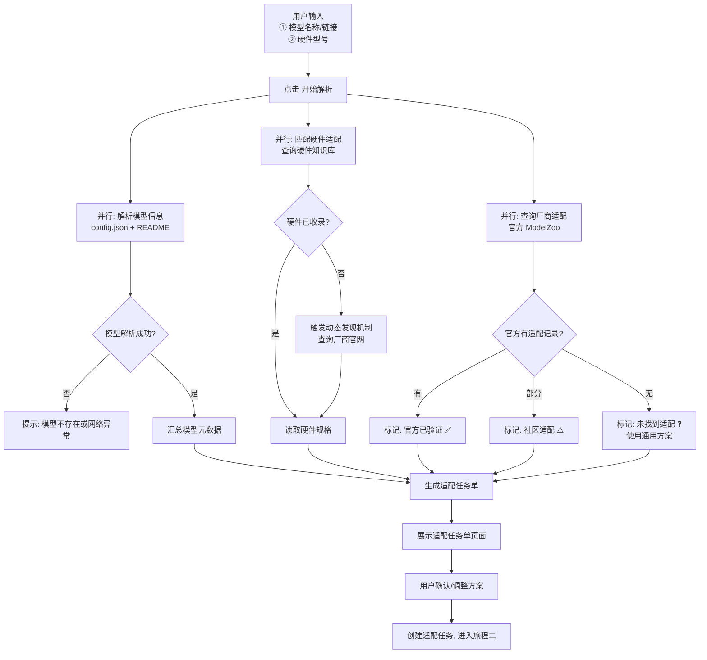

#### 3.1.3 子场景：模型信息解析详情

- **【Model Card 智能解析规则】**：

  系统从模型的 `README.md`（Model Card）中自动提取以下信息：

  | 提取内容 | 解析方式 | 示例 |
  |:--|:--|:--|
  | 推荐推理框架 | 匹配关键词：`vllm`、`transformers`、`tgi`、`sglang` | "推荐使用 vLLM >= 0.6.0" |
  | 推荐启动命令 | 匹配代码块（```bash / ```python） | `vllm serve Qwen/Qwen2.5-72B --tp 4` |
  | 推荐量化方式 | 匹配关键词：`GPTQ`、`AWQ`、`GGUF`、`FP8` | "推荐使用 AWQ 量化版本" |
  | 最低显存要求 | 匹配数字 + GB/显存模式 | "至少需要 4×A100 80G" |
  | Chat Template | 匹配 `chat_template` 字段或示例代码 | Jinja2 模板 |
  | 特殊参数要求 | 匹配 `--xxx` 格式参数 | `--trust-remote-code`、`--enforce-eager` |
  | 已知限制 | 匹配"注意"/"Warning"/"限制"段落 | "不支持 Flash Attention 2" |

  **解析策略**：
  - 优先使用 LLM 辅助结构化提取（调用平台内置小模型或外部 API），兜底使用正则匹配。
  - 解析结果缓存 24 小时，避免重复解析。

- **【config.json 自动解析字段】**：

  | 提取字段 | 示例值 | 用途 |
  |:--|:--|:--|
  | `model_type` | `qwen2` | 确定模型架构族 |
  | `hidden_size` | `8192` | 计算 KV Cache 显存 |
  | `num_hidden_layers` | `80` | 计算参数量、Pipeline Parallel 切分 |
  | `num_attention_heads` | `64` | 计算 Tensor Parallel 切分粒度 |
  | `num_key_value_heads` | `8` | GQA 下 KV Cache 大小 |
  | `intermediate_size` | `29568` | 计算 FFN 层显存 |
  | `vocab_size` | `152064` | 计算 Embedding 层显存 |
  | `max_position_embeddings` | `131072` | 最大上下文长度上限 |
  | `torch_dtype` | `bfloat16` | 权重默认精度 |
  | `rope_scaling` | `{type: "yarn", factor: 4}` | 超长上下文扩展方式 |
  | `architectures` | `["Qwen2ForCausalLM"]` | 推理引擎兼容性判断 |

#### 3.1.4 子场景：未知硬件型号的动态发现

- **【场景说明】**：用户输入的硬件型号不在本地知识库中（如昇腾新发布的 910D）。
- **【期望效果】**：系统自动从厂商官方渠道查询该硬件信息，补全知识库条目。

- **【识别规则】**：

  | 关键词匹配 | 识别结果 | 查询源 |
  |:--|:--|:--|
  | `910`、`310`、`ascend`、`昇腾` | 华为昇腾 | https://www.hiascend.com/ |
  | `K100`、`Z100`、`DCU`、`海光` | 海光 DCU | https://developer.sourcefind.cn/ |
  | `C5`、`N2`、`沐曦`、`metax` | 沐曦 MetaX | https://www.metax-tech.com/ |
  | `R2`、`R3`、`昆仑`、`kunlun`、`XPU` | 百度昆仑芯 | https://www.kunlunxin.com/ |
  | `BI-`、`MR-`、`天数`、`iluvatar` | 天数智芯 | https://www.iluvatar.com/ |

- **【查询策略】**：

  | 优先级 | 数据源 | 方式 | 可获取信息 |
  |:--|:--|:--|:--|
  | P0 | 厂商官方 API（若有） | REST API | 结构化硬件规格 |
  | P1 | 厂商官方文档页面 | 页面解析 | 产品规格表、适配说明 |
  | P2 | 厂商 ModelZoo / 适配列表 | 页面解析 | 已验证模型、推荐配置 |
  | P3 | 厂商 SDK 发布说明 | Release Notes 解析 | 版本兼容矩阵 |

- **【结果处理】**：
  - **信息完整**：自动补全知识库，标记来源为 `official-inferred`，继续正常流程。
  - **信息部分获取**：展示已获取内容，请用户补充缺失项（如算力、SDK 版本）。
  - **查询失败**：提供手动录入表单，所有字段均需用户填写。
  - 新录入的硬件信息持久化到知识库，后续同型号直接命中。

---

### 3.2 旅程二：模型权重下载

#### 3.2.1 特性概述

- **【客户问题及原始诉求】**：
  - **痛点**：大模型权重文件动辄几十 GB，从 HuggingFace 下载网络不稳定易中断；ModelScope 和 HuggingFace 的模型命名/目录结构不统一，用户需自行判断该下载哪些文件。更重要的是，用户有时需要 **将权重直接下载到远程部署环境**（而非本地开发机），目前缺乏便捷方式。
  - **现有方案**：手动 `git lfs clone` 或 `huggingface-cli download`，断点续传需自行处理；下载到远程环境需 SSH + 手动传输。

- **【客户 Jobs 分析】**：
  1. 确认下载源（HuggingFace / ModelScope） → 2. 选择下载目标（本地 / 远程环境） → 3. 断点续传下载 → 4. 完整性校验 → 5. 文件就位确认

- **【客户旅程对比】**：
  - *现状旅程*：判断下哪些文件 → 命令行下载 → 中断后手动重试 → 下完校验 → scp 传到目标环境 → 确认目录结构对不对
  - *未来旅程*：在适配任务单中点击"下载权重" → 选择下载目标 → 一键下载 → 自动校验 → 文件直达目标环境

#### 3.2.2 主场景：下载模型权重文件

- **【场景说明】**：用户在适配任务单页面，点击下载模型权重，选择将权重下载到本地或指定远程环境。
- **【期望效果】**：模型权重完整下载到指定位置，文件校验通过，状态变为"可用"。
- **【前置条件】**：旅程一已完成（适配任务单已创建）；网络可达（至少能访问 HuggingFace 或 ModelScope 之一）。
- **【操作步骤】**：
  1. 在适配任务单页面，进入"模型权重"区域，点击 **"下载权重"** 按钮。
  2. 系统展示模型权重文件清单（文件名、大小、类型），用户可预览。
  3. 选择 **下载源**：
     - HuggingFace（默认根据网络探测推荐）。
     - ModelScope。
     - 若双源均可用，默认推荐 ModelScope（国内网络更稳定）。
  4. 选择 **下载目标位置**：
     - **下载到本地**：指定本地存储路径（默认 `/data/models/{source}/{model_name}`）。
     - **下载到指定环境**：从已注册的环境列表中选择目标环境 + 指定远程路径。
  5. 点击 **"开始下载"**，进入下载进度页面。
  6. 进度页面展示：
     - 总体进度百分比 & 预计剩余时间。
     - 各文件下载状态（等待中 / 下载中 / 已完成 / 失败）。
     - 实时下载速度。
  7. 下载完成后，系统自动执行 SHA256 文件完整性校验。
  8. 校验通过，模型权重状态变为 **"已就位 ✅"**，适配任务单更新。
  9. 用户可继续进入旅程三。

- **【需求规格约束】**：
  - **界面/字段约束**：

    | 字段 | 类型 | 必填 | 约束 | 默认值 |
    |:--|:--|:--|:--|:--|
    | 下载源 | Enum | 是 | `huggingface` / `modelscope` | 网络探测自动推荐 |
    | 下载目标 | Enum | 是 | `local` / `remote` | `local` |
    | 本地存储路径 | String | 条件必填 | 需校验磁盘可用空间 | `/data/models/{source}/{model_name}` |
    | 远程环境 | Select | 条件必填 | 从已注册环境列表选择 | - |
    | 远程存储路径 | String | 条件必填 | 需校验远程磁盘可用空间 | `/data/models/{model_name}` |

  - **逻辑校验**：
    - 下载前校验目标位置磁盘剩余空间 ≥ 模型文件总大小 × 1.2（预留 20% 余量）。
    - 下载中断后自动重试 3 次，间隔 10s / 30s / 60s 递增。
    - 3 次重试失败后任务状态标记为"中断"，支持用户手动"继续下载"（断点续传）。
    - 文件校验失败时，标记具体文件并提示"重新下载该文件"。
    - 远程下载模式下，系统通过已注册环境的连接信息（SSH / Agent），在远程环境直接执行下载，而非本地下载后传输。

- **【业务流程图】**：

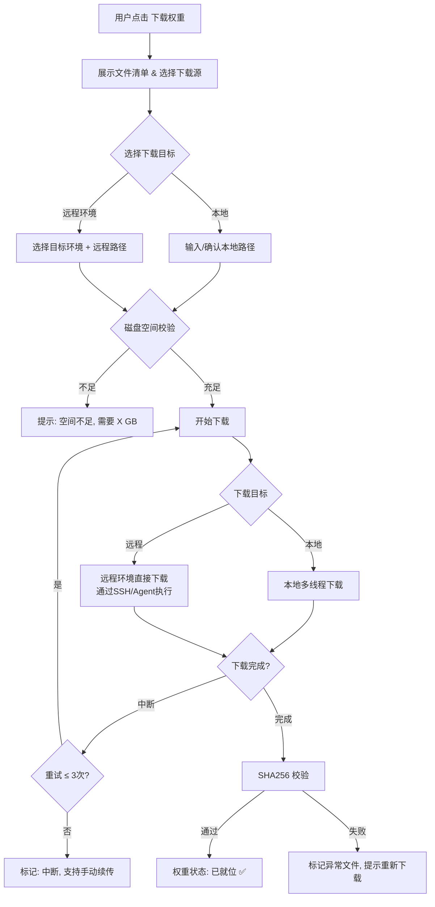

#### 3.2.3 子场景：模型版本与变体管理

- **【期望效果】**：同一模型的不同量化版本（如 FP16 / INT8 / INT4 / GPTQ / AWQ）可并存管理，用户可按需选择。
- **【操作步骤】**：
  1. 在模型权重区域，展示该模型的可用变体列表（从源站自动拉取）。
  2. 用户勾选需要下载的变体。
  3. 变体存储在同一模型目录下的子目录中：`/{model_name}/{variant}/`。
- **【规格约束】**：
  - 模型列表需展示：变体名称、文件大小、推荐显存、适用推理框架。
  - 删除某一变体时，不影响同模型的其他变体（无级联删除）。

---

### 3.3 旅程三：推理引擎镜像生成

#### 3.3.1 特性概述

- **【客户问题及原始诉求】**：
  - **痛点**：构建推理镜像涉及多个环节——查阅模型官方启动说明、查阅硬件厂商适配文档、选择合适的推理引擎版本、编写 Dockerfile、配置启动命令参数。这些环节高度依赖人工经验，且不同硬件差异巨大（N卡 vs 昇腾 vs 海光的 Dockerfile 完全不同）。
  - **更关键的是**：即使镜像构建成功，启动命令的参数配置（`tensor-parallel-size`、`max-model-len`、`dtype` 等）需要工程师综合考量模型架构、权重精度、硬件显存等因素手动计算，一个参数配错就 OOM 或资源浪费。
  - **现有方案**：查厂商文档 → 找兼容矩阵 → 手写 Dockerfile → build 失败 → 排查依赖 → 凭经验配参数 → 启动 OOM → 调参 → 循环数次。

- **【客户 Jobs 分析】**：
  1. 查询模型官方配置说明 → 2. 查询硬件厂商适配说明 → 3. 下载推荐的推理引擎镜像 → 4. 推算启动命令参数 → 5. 判断是否需要封装 HTTP API → 6. 生成完整镜像包 + 启动命令 → 7. 展示推荐硬件部署规格 → 8. 支持用户修改规格后重新推算

- **【客户旅程对比】**：
  - *现状旅程*：查 Model Card → 查厂商文档 → 手写 Dockerfile → build 失败 → 排查 → 再 build → 手算显存 → 猜参数 → 启动 → OOM → 降参数 → 再启动 → 发现没有 HTTP 接口 → 写 FastAPI 代码 → 终于能用
  - *未来旅程*：在适配任务单中点击"生成推理引擎镜像" → 系统自动完成全部工作 → 展示镜像 + 启动命令 + 推荐卡数 → 用户调整卡数后一键更新参数 → 完成

#### 3.3.2 主场景：一键生成推理引擎镜像与启动命令

- **【场景说明】**：用户在适配任务单页面，点击生成推理引擎镜像，系统自动完成从查询配置到输出可用镜像包和启动命令的全流程。
- **【期望效果】**：
  1. 生成一个适配目标硬件的推理引擎 Docker 镜像包。
  2. 生成一套完整的启动命令及参数配置（每个参数附带推算依据）。
  3. 若模型原生不提供 HTTP 服务，自动注入 FastAPI 封装的 OpenAI 兼容 API。
  4. 给出推荐的硬件部署规格（需要几张卡），支持用户修改后重新推算。
- **【前置条件】**：旅程一已完成；模型权重已下载（旅程二已完成）或 `config.json` 可获取。
- **【操作步骤】**：

  **第一阶段：自动查询与匹配**
  1. 用户在适配任务单页面，点击 **"生成推理引擎镜像"** 按钮。
  2. 系统后台并行执行以下查询：
     - **a. 查询模型官方配置**：解析 Model Card 中的推荐推理框架、启动命令、特殊参数。
     - **b. 查询硬件厂商适配说明**：
       - 昇腾 → 查询昇腾社区 / MindIE 适配清单。
       - 海光 → 查询光合社区 ModelZoo（https://developer.sourcefind.cn/codes/modelzoo/）。
       - 沐曦 → 查询沐曦开发者中心。
       - 昆仑芯 → 查询昆仑芯开发者中心。
       - 天数 → 查询天数智芯开发者中心。
       - NVIDIA → 无特殊要求，使用通用方案。
     - **c. 匹配推理引擎镜像**：确定推理引擎及版本，查找或构建对应基础镜像。
  3. 系统展示查询结果摘要：
     ```
     📄 模型官方说明: 推荐 vLLM >= 0.6.0, 需 --trust-remote-code
     🔧 厂商适配状态: 昇腾 MindIE 1.0 已验证该模型 ✅
     🐳 推荐基础镜像: ascendhub.huawei.com/public-ascendhub/mindie:1.0-cann8.0
     ```

  **第二阶段：启动参数智能推算与硬件规格推荐**
  4. 系统基于 [启动参数智能推算引擎](#41-启动参数智能推算引擎)，自动计算全部启动参数。
  5. 页面展示 **参数推算报告**，包含：
     - **推荐硬件部署规格**（核心展示）：

       ```
       ┌──────────────────────────────────────┐
       │  推荐硬件部署规格                     │
       │  硬件: 昇腾 910B4 64G                │
       │  推荐卡数: 4 张              [修改 ✏️] │
       │  总显存: 256 GB                      │
       │  部署模式: 单机 Tensor Parallel      │
       └──────────────────────────────────────┘
       ```

     - **启动参数详情**（每个参数附带推算依据）：

       | 参数 | 推荐值 | 推算依据 | 可调整 |
       |:--|:--|:--|:--|
       | dtype | bf16 | config.json 默认精度, 910B4 支持 ✅ | 是 |
       | tensor-parallel-size | 4 | 权重 144GB / 单卡 64GB → 最少 3 卡, 对齐到 4 | 随卡数联动 |
       | max-model-len | 32768 | 剩余显存支持 32K 上下文 | 是 |
       | max-num-seqs | 32 | 基于 KV Cache 容量推算 | 是 |
       | enforce-eager | true | 910B4 不支持 CUDA Graph | 自动 |
       | trust-remote-code | true | Model Card 明确要求 | 自动 |

     - **显存分配可视化**：

       ```
       每卡 64 GB 显存分配:
       ████████████████████ 权重 36GB (56%)
       ██████████ KV Cache 21.6GB (34%)
       ███ 运行时 3.2GB (5%)
       ░░ 预留 3.2GB (5%)
       ```

  6. **用户修改硬件规格**：
     - 用户点击"修改"按钮，调整卡数（如从 4 改为 8）。
     - 系统 **实时重新推算** 所有关联参数：
       - 卡数 4→8：`tensor-parallel-size` 4→8，`max-model-len` 32768→65536，`max-num-seqs` 32→128。
     - 页面实时更新参数表和显存分配图，变化项红色高亮。
     - **参数联动规则**：

       | 用户调整 | 联动影响 |
       |:--|:--|
       | 增加卡数 | 增大 `max-model-len` 和 `max-num-seqs` |
       | 减少卡数 | 减小 `max-model-len`，可能建议量化 |
       | 调大 `max-model-len` | 减小 `max-num-seqs`，或提示需增加卡数 |
       | 切换 dtype（FP16→INT8） | 权重显存减半，可减少卡数或增大上下文 |

  **第三阶段：镜像构建**
  7. 用户确认参数，点击 **"构建镜像"**。
  8. 系统自动生成 Dockerfile（含硬件专用配置）。
  9. 系统检查模型原生推理框架是否提供 HTTP 服务：
     - **提供**（如 vLLM、TGI）：直接使用，无需额外封装。
     - **不提供**（如原生 transformers、部分国产卡专用框架）：自动注入 FastAPI 包装层（详见 [4.3 OpenAI 兼容 API 封装](#43-openai-兼容-api-封装)）。
  10. 执行 `docker build`，实时展示构建日志。
  11. 构建完成后，展示最终产出物：

      ```
      ✅ 推理引擎镜像生成完成

      📦 镜像信息:
        名称: llm-deploy/qwen2.5-72b:mindie-ascend910b4-20260301
        大小: 15.2 GB
        基础镜像: ascendhub.huawei.com/mindie:1.0-cann8.0
        推理引擎: MindIE 1.0
        API 封装: 无需 (MindIE 原生支持 OpenAI API)

      🚀 启动命令:
        mindie-service \
          --model /models/Qwen2.5-72B-Instruct \
          --npu 0,1,2,3 \
          --dtype bf16 \
          --max-seq-len 32768 \
          --max-batch-size 32 \
          --trust-remote-code \
          --host 0.0.0.0 --port 8000

      💻 推荐部署规格:
        硬件: 昇腾 910B4 64G × 4
        部署模式: 单机 Tensor Parallel
      ```

  12. 适配任务单更新，镜像状态变为 **"已生成 ✅"**，进入旅程四。

- **【需求规格约束】**：
  - **镜像构建约束**：
    - 生成的 Dockerfile 需包含 `HEALTHCHECK` 指令（HTTP 探测 `/health`）。
    - 镜像 Tag 自动生成格式：`{model_name}-{hardware}-{framework}-{date}`，可自定义，最大 128 字符。
    - 支持推送至指定镜像仓库（可选）。
  - **安全边界**：
    - `gpu-memory-utilization` 不可超过 0.95。
    - `max-model-len` 不可超过 `max_position_embeddings`。
    - `tensor-parallel-size` 必须整除 `num_attention_heads` 和 `num_key_value_heads`。
    - 推算结果若显存利用率 > 95%，强制标注 ⚠️ 警告。
  - **显存不足时自动降级**：

    ```
    ⚠️ 当前硬件显存不足，推荐以下方案：

    ┌─────────┬──────────────┬──────┬──────────────┬──────────┐
    │ 方案     │ 策略          │ 卡数  │ max-model-len│ 预估质量  │
    ├─────────┼──────────────┼──────┼──────────────┼──────────┤
    │ 方案A    │ INT8 量化     │ 2卡   │ 16384        │ 损失 <1% │
    │ 方案B ✨ │ AWQ-INT4 量化 │ 2卡   │ 32768        │ 损失 ~2% │
    │ 方案C    │ 增加至 4 卡   │ 4卡   │ 65536        │ 无损     │
    └─────────┴──────────────┴──────┴──────────────┴──────────┘
    ✨ 推荐方案B：显存利用率最优，质量损失可接受
    ```

- **【业务流程图】**：

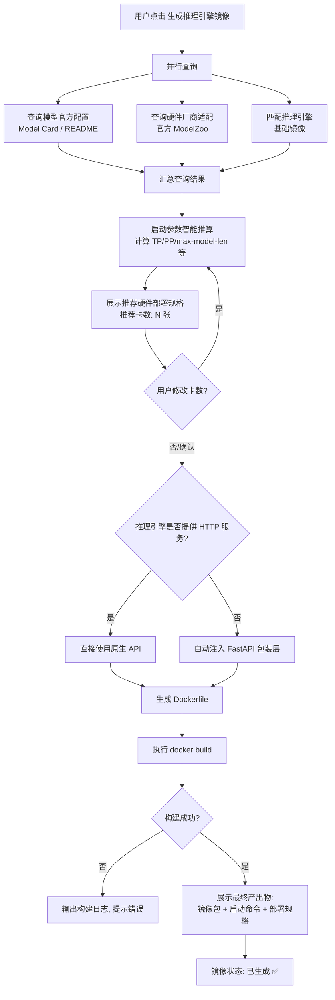

#### 3.3.3 子场景：不同硬件的启动命令差异

系统针对不同硬件自动生成差异化的启动命令：

**NVIDIA（以 vLLM 为例）**：
```bash
docker run -d \
  --name qwen2.5-72b-vllm \
  --gpus '"device=0,1,2,3"' \
  --shm-size 16g \
  -p 8000:8000 \
  -v /data/models/Qwen2.5-72B:/models/Qwen2.5-72B \
  llm-deploy/qwen2.5-72b:vllm-nvidia-20260301 \
  python -m vllm.entrypoints.openai.api_server \
    --model /models/Qwen2.5-72B \
    --tensor-parallel-size 4 \
    --max-model-len 65536 \
    --gpu-memory-utilization 0.9 \
    --host 0.0.0.0 --port 8000
```

**昇腾 910B4（以 MindIE 为例）**：
```bash
docker run -d \
  --name qwen2.5-72b-mindie \
  --device /dev/davinci0 --device /dev/davinci1 \
  --device /dev/davinci2 --device /dev/davinci3 \
  --device /dev/davinci_manager --device /dev/devmm_svm --device /dev/hisi_hdc \
  -v /usr/local/Ascend/driver:/usr/local/Ascend/driver \
  --shm-size 16g -p 8000:8000 \
  -v /data/models/Qwen2.5-72B:/models/Qwen2.5-72B \
  llm-deploy/qwen2.5-72b:mindie-ascend910b4-20260301 \
  mindie-service \
    --model /models/Qwen2.5-72B \
    --npu 0,1,2,3 --dtype bf16 \
    --max-seq-len 32768 --max-batch-size 32 \
    --host 0.0.0.0 --port 8000
```

**海光 K100_AI（以 vLLM-DCU 为例）**：
```bash
docker run -d \
  --name qwen2.5-72b-vllm-dcu \
  --device /dev/kfd --device /dev/dri \
  --group-add video --shm-size 16g -p 8000:8000 \
  -e HIP_VISIBLE_DEVICES=0,1,2,3 \
  -v /data/models/Qwen2.5-72B:/models/Qwen2.5-72B \
  llm-deploy/qwen2.5-72b:vllm-dcu-20260301 \
  python -m vllm.entrypoints.openai.api_server \
    --model /models/Qwen2.5-72B \
    --tensor-parallel-size 4 \
    --max-model-len 32768 \
    --host 0.0.0.0 --port 8000
```

**沐曦 C500（以 MACA-vLLM 为例）**：
```bash
docker run -d \
  --name qwen2.5-72b-maca \
  --device /dev/mxgpu0 --device /dev/mxgpu1 \
  --device /dev/mxgpu2 --device /dev/mxgpu3 \
  --shm-size 16g -p 8000:8000 \
  -e MACA_VISIBLE_DEVICES=0,1,2,3 \
  -v /data/models/Qwen2.5-72B:/models/Qwen2.5-72B \
  llm-deploy/qwen2.5-72b:vllm-metax-20260301 \
  python -m vllm.entrypoints.openai.api_server \
    --model /models/Qwen2.5-72B \
    --tensor-parallel-size 4 \
    --host 0.0.0.0 --port 8000
```

**昆仑芯 R200（以 FastDeploy 为例）**：
```bash
docker run -d \
  --name qwen2.5-72b-xpu \
  --device /dev/xpu0 --device /dev/xpu1 \
  --device /dev/xpu2 --device /dev/xpu3 \
  --device /dev/xpuctrl \
  --shm-size 16g -p 8000:8000 \
  -v /data/models/Qwen2.5-72B:/models/Qwen2.5-72B \
  llm-deploy/qwen2.5-72b:fastdeploy-kunlunxin-20260301 \
  python -m fastdeploy.serving.openai_api_server \
    --model /models/Qwen2.5-72B \
    --xpu_ids 0,1,2,3 \
    --host 0.0.0.0 --port 8000
```

**天数智芯 BI-150（以 IGIE 为例）**：
```bash
docker run -d \
  --name qwen2.5-72b-igie \
  --device /dev/ixgpu0 --device /dev/ixgpu1 \
  --device /dev/ixgpu2 --device /dev/ixgpu3 \
  --shm-size 16g -p 8000:8000 \
  -e IX_VISIBLE_DEVICES=0,1,2,3 \
  -v /data/models/Qwen2.5-72B:/models/Qwen2.5-72B \
  llm-deploy/qwen2.5-72b:igie-iluvatar-20260301 \
  igie-serving \
    --model /models/Qwen2.5-72B \
    --devices 0,1,2,3 \
    --host 0.0.0.0 --port 8000
```

---

### 3.4 旅程四：部署与启动

#### 3.4.1 特性概述

- **【客户问题及原始诉求】**：
  - **痛点**：镜像和权重准备好后，还需要手动上传到目标环境、编写部署配置、处理 GPU 资源声明、验证服务是否真正可用。尤其在 K8s 环境下，YAML 编写复杂度高。
  - **现有方案**：scp/docker push 上传文件 → 手写 docker run / kubectl apply → 看日志确认启动 → 手动 curl 测试。

- **【客户 Jobs 分析】**：
  1. 上传模型权重到指定环境 → 2. 上传推理引擎镜像到指定环境 → 3. 环境预检 → 4. 下发启动命令 → 5. 等待服务就绪 → 6. 自动验证

- **【客户旅程对比】**：
  - *现状旅程*：scp 传权重文件 → docker load/push 传镜像 → 手写 docker run → 看日志 → 发现 GPU 驱动不匹配 → 升级驱动 → 再启动 → 手动 curl 测试
  - *未来旅程*：在适配任务单中点击"部署" → 选择目标环境 → 系统自动上传+预检+部署+验证 → 返回 API 地址

#### 3.4.2 主场景：上传文件并部署模型服务

- **【场景说明】**：用户在适配任务单页面，将模型权重和推理引擎镜像上传到指定环境，并启动模型服务。
- **【期望效果】**：模型推理服务在目标环境成功启动，自动验证通过，返回可访问的 API Endpoint。
- **【前置条件】**：旅程三已完成（镜像已生成）；目标环境已注册。
- **【操作步骤】**：

  **第一阶段：选择目标环境与部署模式**
  1. 用户在适配任务单页面，点击 **"部署到环境"** 按钮。
  2. 选择 **目标环境**（从已注册环境列表选择）：
     - Docker 主机环境
     - K8s 集群环境
  3. 输入连接信息（若环境未预先注册）：
     - Docker：`host:port` 或 SSH 连接信息。
     - K8s：上传 kubeconfig 或选择已配置的集群。
  4. 选择 **部署模式**：
     - **单实例部署**：1 个容器/Pod，使用指定 GPU 数量。
     - **单机多实例部署**：同一机器多个实例，负载均衡。
     - **多机分布式推理部署**：跨节点分布式推理（Pipeline Parallel）。

  **第二阶段：文件上传**
  5. 系统检查目标环境中权重文件和镜像的状态：
     - **模型权重**：
       - 若旅程二已直接下载到该环境 → 跳过上传，显示"权重已就位 ✅"。
       - 若权重在本地 → 展示上传进度，通过 SSH/rsync 传输到目标环境。
     - **推理引擎镜像**：
       - 若镜像已推送到目标环境可访问的镜像仓库 → 跳过，显示"镜像可拉取 ✅"。
       - 若镜像仅在本地 → 展示上传方式选项：
         - `docker save` + 传输 + `docker load`（离线环境）。
         - `docker push` 到指定仓库 + 目标环境 `docker pull`（在线环境）。
  6. 上传进度实时展示。

  **第三阶段：环境预检**
  7. 文件就位后，系统自动执行 **环境预检**（并行采集）：

     | 检查项 | 检查内容 | 通过条件 |
     |:--|:--|:--|
     | GPU/NPU 设备 | 设备型号、数量 | 与部署方案要求的卡数一致 |
     | 单卡显存 | 每张卡的可用显存 | ≥ 模型推理所需最小显存 |
     | 驱动版本 | GPU Driver / npu-driver | ≥ 推理框架要求的最低版本 |
     | 计算框架版本 | CUDA / CANN / DTK / MACA / IXUCA | 与推理框架兼容矩阵匹配 |
     | Docker 版本 | Docker Engine | ≥ 20.10 |
     | 容器 Toolkit | nvidia-container-toolkit / Ascend Docker Runtime 等 | 已安装且可用 |
     | K8s 设备插件 | nvidia-device-plugin / ascend-device-plugin 等 | 已部署且 Running（K8s 模式） |
     | 磁盘空间 | 模型存储目录 | ≥ 所需空间 × 1.2 |
     | 网络连通性 | 镜像仓库可达性 | 可 pull 镜像 |

     **各厂商设备检测命令**：

     | 厂商 | 检测命令 | 驱动版本 | 计算框架版本 |
     |:--|:--|:--|:--|
     | NVIDIA | `nvidia-smi` | Driver Version | CUDA Version |
     | 昇腾 | `npu-smi info` | npu-driver ver | CANN Version |
     | 海光 | `rocm-smi` | dcu-driver ver | DTK Version |
     | 沐曦 | `mx-smi` | mx-driver ver | MACA Version |
     | 昆仑芯 | `xpu_smi` | xpu-driver ver | XTDK Version |
     | 天数 | `ixsmi` | ix-driver ver | IXUCA Version |

  8. 输出预检报告：

     ```
     ╔══════════════════════════════════════════════════╗
     ║         环境预检报告 - prod-node-01              ║
     ╠══════════════════════════════════════════════════╣
     ║ ✅ NPU 设备检测     8 × Ascend 910B4 64G        ║
     ║ ✅ NPU 驱动版本     24.1.RC3 (≥ 24.1.RC2)      ║
     ║ ✅ CANN 版本        8.0.RC3 (匹配 MindIE 1.0)  ║
     ║ ✅ Docker 版本      24.0.7 (≥ 20.10)           ║
     ║ ✅ Ascend Runtime   已安装                       ║
     ║ ✅ 磁盘空间         剩余 500GB (需要 200GB)     ║
     ║ ✅ 模型权重         已就位                       ║
     ║ ✅ 推理镜像         已就位                       ║
     ╠══════════════════════════════════════════════════╣
     ║ 结果: 全部通过 ✅ 可以部署                       ║
     ╚══════════════════════════════════════════════════╝
     ```

  9. 预检结果处理：
     - **全部通过** → 启用"立即部署"按钮。
     - **存在不通过项** → 展示修复建议（如"请将驱动从 535 升级到 550"），"立即部署"禁用。
     - 用户可选择"强制跳过"（需二次确认风险提示）。

  **第四阶段：下发启动命令与验证**
  10. 用户点击 **"立即部署"**。
  11. 系统根据部署模式下发启动命令：
      - **Docker 单实例**：执行 `docker run` 命令。
      - **Docker 多实例**：生成并执行 `docker-compose.yml`（含负载均衡 Nginx）。
      - **K8s**：生成并执行 K8s YAML（Deployment/StatefulSet + Service）。
  12. 实时展示部署状态：
      - Docker：容器日志流。
      - K8s：Pod 状态流（Pending → ContainerCreating → Running）。
  13. 检测到服务 Ready 标志后（通过 Health Check），自动发送 **验证请求**：

      ```json
      {
        "model": "Qwen2.5-72B-Instruct",
        "messages": [{"role": "user", "content": "你好，请用一句话介绍你自己"}],
        "max_tokens": 50,
        "temperature": 0.1
      }
      ```

  14. 验证通过标准：
      - HTTP 200 响应。
      - `choices[0].message.content` 非空。
      - 响应时间 ≤ 30s（首次含冷启动）。
  15. 验证通过后，页面展示最终结果：

      ```
      ✅ 模型服务部署成功！

      🌐 API 地址: http://10.0.1.100:8000/v1/chat/completions
      📊 服务状态: Running
      💻 硬件: 昇腾 910B4 64G × 4
      🚀 推理引擎: MindIE 1.0
      ⏱️  首次响应延迟: 2.3s

      测试命令:
      curl http://10.0.1.100:8000/v1/chat/completions \
        -H "Content-Type: application/json" \
        -d '{"model":"Qwen2.5-72B-Instruct","messages":[{"role":"user","content":"hello"}]}'
      ```

  16. 适配任务单状态更新为 **"部署完成 ✅"**。

- **【业务流程图】**：

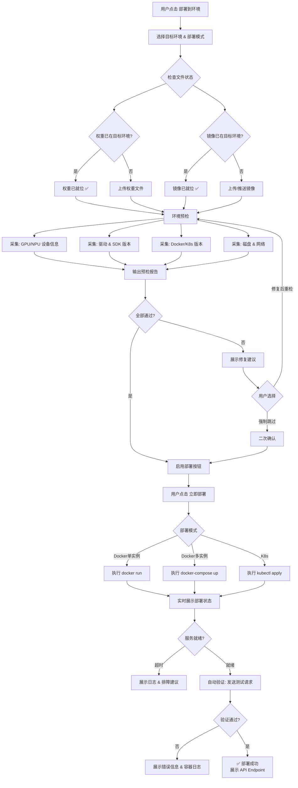

#### 3.4.3 子场景：Docker 单机多实例部署

- **【场景说明】**：一台机器上有多张 GPU，用户启动多个推理实例，通过负载均衡统一入口。
- **【操作步骤】**：
  1. 选择部署模式："Docker - 单机多实例"。
  2. 配置实例数量与 GPU 分配策略：
     - 示例：8 卡机器部署 2 个实例，每实例 4 卡。
     - GPU 分配：实例1 → GPU 0-3，实例2 → GPU 4-7。
  3. 选择负载均衡方式：Round-Robin（默认）/ Least-Connections。
  4. 系统生成 `docker-compose.yml`，包含：
     - N 个推理服务容器（GPU 隔离）。
     - 1 个 Nginx 容器（负载均衡 + 健康检查）。
  5. 一键执行 `docker compose up -d`。
  6. 逐一验证各实例健康状态，验证负载均衡入口。
- **【规格约束】**：
  - GPU 分配不可重叠，系统自动校验。
  - 负载均衡健康检查：每 10s 探测 `/health`，连续 3 次失败摘除实例。
  - docker-compose.yml 包含 `restart: unless-stopped`。

#### 3.4.4 子场景：K8s 分布式推理部署

- **【场景说明】**：模型过大，需要跨节点分布式推理（Pipeline Parallel 或 Tensor Parallel across nodes）。
- **【操作步骤】**：
  1. 选择部署模式："K8s - 分布式推理"。
  2. 配置分布式参数：
     - 节点数量、每节点 GPU 数量。
     - 通信方式：NCCL / HCCL（昇腾）。
  3. 系统生成 K8s 资源清单：
     - StatefulSet（保证 Pod 有序启动，rank-0 为 master）。
     - HeadlessService（Pod 间互相发现）。
     - ConfigMap（分布式配置：MASTER_ADDR、WORLD_SIZE、RANK 等）。
  4. Pod 间配置 `hostNetwork: true` 或 RDMA 网络。
- **【K8s 资源清单必含项】**：
  - `resources.limits` 中的 GPU/NPU 资源声明（如 `huawei.com/Ascend910: 4`）。
  - `tolerations`（GPU 节点 taint）。
  - `nodeSelector` / `nodeAffinity`（按硬件型号调度）。
  - `volumes` + `volumeMounts`（模型权重 PVC 挂载）。
  - `readinessProbe` + `livenessProbe`（HTTP `/health`）。
  - `terminationGracePeriodSeconds: 120`（大模型卸载需要时间）。

### 3.5 模型适配异常场景处理

> 并非所有模型都是"标准对话大模型"。实际适配中会遇到各类非标准场景，本节定义系统对这些场景的识别方式与处理策略。

#### 3.5.1 场景总览

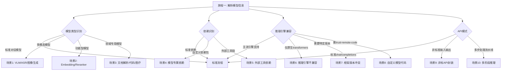

#### 3.5.2 场景1：多模态模型适配（VLM / ASR / 图像生成）

**典型模型**：MinerU2.5（视觉文档解析）、Qwen2-VL（视觉语言）、Qwen3-ASR（语音识别）、Whisper、Stable Diffusion

**识别方式**：
- 解析 `config.json` 中的 `model_type` 或 `architectures` 字段：
  - `Qwen2VLForConditionalGeneration` → VLM
  - `WhisperForConditionalGeneration` → ASR
  - `StableDiffusionPipeline` → 图像生成
- 解析 Model Card 中的任务标签（task tag）：`image-text-to-text`、`automatic-speech-recognition`、`text-to-image`

**处理策略**：

| 模型类型 | 输入格式差异 | API 封装方案 | 特殊处理 |
|:--|:--|:--|:--|
| **VLM（视觉语言）** | 图像 + 文本混合输入 | 封装 `/v1/chat/completions` 扩展 `image_url` 字段（兼容 OpenAI Vision API 格式） | 需安装图像处理依赖（Pillow、torchvision） |
| **ASR（语音识别）** | 音频文件/流式音频输入 | 封装 `/v1/audio/transcriptions`（兼容 OpenAI Whisper API） | 需安装音频处理依赖（ffmpeg、librosa、soundfile） |
| **图像生成** | 文本 prompt 输入，图像输出 | 封装 `/v1/images/generations`（兼容 OpenAI DALL-E API） | 显存使用模式不同（非 KV Cache 模式），参数推算逻辑需调整 |
| **文档解析（如 MinerU）** | 高分辨率图像输入，结构化数据输出 | 自定义 `/v1/document/extract` + 兼容标准 VLM 接口 | 可能需要多阶段推理（layout → recognition） |

**MinerU2.5 适配示例**：

```
模型解析结果：
  架构: Qwen2VLForConditionalGeneration (VLM)
  参数量: 1.2B
  权重格式: SafeTensors (2.3GB)
  精度: BF16
  特殊依赖: mineru-vl-utils[vllm]
  推荐引擎: vLLM (0.9.2+) / vLLM-Async
  API模式: 自定义 (two_step_extract) → 需封装

系统处理:
  ✅ 识别为 VLM 类型，标记输入格式为"图像+文本"
  ✅ 检测到自定义依赖 mineru-vl-utils，加入镜像构建
  ✅ 检测到非标 API 模式，生成 FastAPI 包装:
     - POST /v1/chat/completions (兼容 OpenAI Vision)
     - POST /v1/document/extract (模型专属接口)
  ✅ vLLM 支持该架构，推荐使用 vLLM AsyncEngine
```

#### 3.5.3 场景2：功能型模型适配（Embedding / Reranker）

**典型模型**：bge-m3、jina-embeddings、bge-reranker-v2

**识别方式**：
- `config.json` 中 `architectures` 含 `ForSequenceClassification`（Reranker）或模型标签含 `feature-extraction` / `sentence-similarity`（Embedding）
- Model Card 中标注任务类型为 embedding / reranker

**处理策略**：

| 模型类型 | 与标准对话模型的差异 | API 封装 | 参数推算差异 |
|:--|:--|:--|:--|
| **Embedding** | 无自回归生成，仅需前向计算 | `/v1/embeddings`（兼容 OpenAI） | 无 KV Cache 需求，显存占用更小；批处理吞吐更高 |
| **Reranker** | 输入为 query + document pairs | `/v1/rerank`（自定义，兼容 Cohere API） | 同上 |

**参数推算特殊规则**：
- 不推算 `max-model-len`（Embedding 模型无需长上下文生成）。
- `max-num-seqs` 可显著调高（无 KV Cache 瓶颈）。
- 推荐使用专用推理引擎（如 TEI —— Text Embeddings Inference）。

#### 3.5.4 场景3：领域专用模型适配

**典型模型**：医疗模型（HuatuoGPT）、代码模型（DeepSeek-Coder）、法律模型、金融模型

**识别方式**：Model Card 中描述的应用领域 + 自定义 chat template

**处理策略**：
- 大多数领域模型的 **推理架构与标准对话模型一致**（基于 LLaMA/Qwen/Mistral 等基座），适配流程无差异。
- **关键差异在 Chat Template**：部分领域模型使用自定义的 prompt format（如医疗问诊模板、代码生成模板）。
- 系统从 `tokenizer_config.json` 中的 `chat_template` 字段自动加载，**不做硬编码**。
- 若 `chat_template` 为空，回退到 Model Card 中提取的示例代码推断。

#### 3.5.5 场景4：模型专属依赖（自定义 pip 包）

**典型案例**：MinerU 需要 `mineru-vl-utils[vllm]`，某些模型需要 `flash-attn`、`xformers`、特定版本 `transformers`

**识别方式**：
- 解析 Model Card 中的安装命令代码块（`pip install xxx`）。
- 解析模型仓库中的 `requirements.txt`（若存在）。
- 解析代码中的 `import` 依赖。

**处理策略**：

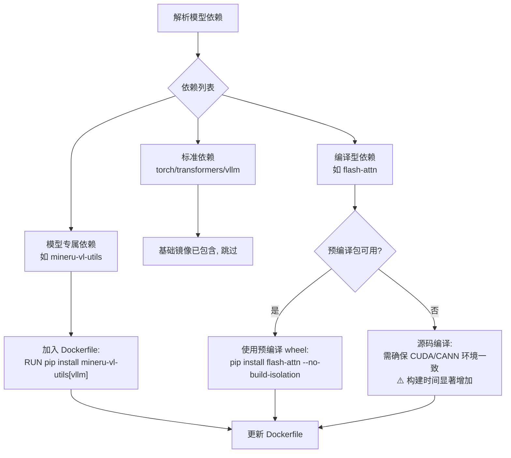

**规格约束**：
- 依赖安装失败时，构建不中止，而是记录警告并提示用户："依赖 `{pkg}` 安装失败，可能影响模型推理，请检查版本兼容性"。
- 依赖解析结果展示在旅程一的适配任务单中，用户可手动补充或修改。
- 对于需要编译的依赖（如 `flash-attn`），自动匹配硬件对应的预编译版本，避免现场编译。

#### 3.5.6 场景5：外部工具链依赖

**典型案例**：MinerU 依赖 PaddleOCR、DocLayout-YOLO；ASR 模型依赖 ffmpeg；部分模型依赖 sentencepiece、protobuf

**识别方式**：
- 解析 Model Card 中的"依赖"/"安装"/"Prerequisites"段落。
- 解析模型仓库中的 `Dockerfile`（若存在）。

**处理策略**：

| 依赖类型 | 安装方式 | Dockerfile 处理 |
|:--|:--|:--|
| Python 包（pip） | `pip install paddleocr` | `RUN pip install paddleocr` |
| 系统工具（apt） | `apt install ffmpeg` | `RUN apt-get update && apt-get install -y ffmpeg` |
| 模型文件（子模型） | 下载额外模型权重 | `RUN python -c "from paddleocr import PaddleOCR; PaddleOCR()"` 预下载 |
| 自定义编译库 | 源码编译 | 根据硬件平台选择对应编译参数 |

**系统处理**：
- 旅程一解析阶段，自动识别外部工具依赖并加入依赖清单。
- 旅程三镜像构建阶段，自动将依赖安装命令注入 Dockerfile。
- 对于需要额外下载子模型的依赖（如 PaddleOCR 的检测模型），在镜像构建阶段预下载，避免运行时首次启动延迟。

#### 3.5.7 场景6：推理引擎不兼容

**典型案例**：新发布的模型架构 vLLM 尚未支持；国产卡推理框架不支持该模型架构；某些模型仅支持原生 transformers 推理

**识别方式**：
- 查询推理引擎的 supported models 列表（vLLM supported models、TGI supported models）。
- 检查 `config.json` 中 `architectures` 是否在引擎支持列表中。

**处理策略**：

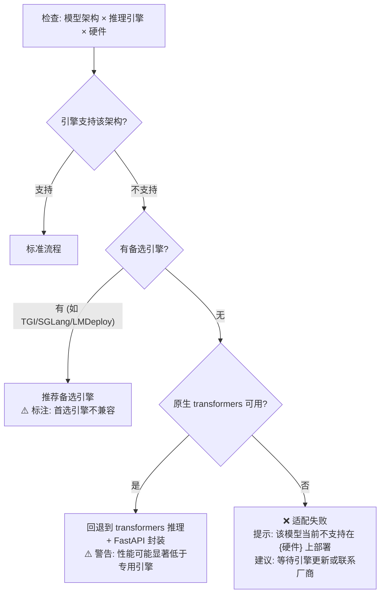

**降级策略优先级**：
1. 首选推理引擎（如 vLLM）
2. 备选推理引擎（TGI → SGLang → LMDeploy）
3. 原生 transformers + FastAPI（性能最低但兼容性最好）
4. 适配失败，明确告知用户

#### 3.5.8 场景7：框架版本冲突

**典型案例**：MinerU 需要 `transformers >= 4.56.0` 和 `vllm >= 0.9.2`，但基础镜像中预装版本不满足；国产卡推理框架固定依赖特定版本的 PyTorch

**识别方式**：
- 解析 Model Card 中明确的版本要求（如 "requires transformers >= 4.56.0"）。
- 解析模型仓库 `requirements.txt` 中的版本约束。
- 与基础镜像/硬件推理框架的预装版本比对。

**处理策略**：

| 冲突类型 | 示例 | 处理方式 |
|:--|:--|:--|
| **模型要求更高版本** | 模型需 transformers>=4.56，镜像中为 4.50 | 在 Dockerfile 中追加 `pip install transformers>=4.56.0` |
| **硬件框架锁定版本** | 昇腾 MindIE 绑定 torch==2.1.0，模型需 torch>=2.3 | ⚠️ 冲突无法自动解决，警告用户并推荐替代方案 |
| **依赖间互斥** | flash-attn 需 torch==2.2，模型需 torch==2.3 | 提供两种构建方案供用户选择（有/无 flash-attn） |

**系统行为**：
- 旅程一解析阶段即执行依赖版本冲突检查，在适配任务单中以 ⚠️ 标注。
- 可自动解决的冲突（升级版本），系统自动处理并记录。
- 不可自动解决的冲突（硬件框架锁定），需用户介入决策。

#### 3.5.9 场景8：自定义模型代码（trust-remote-code）

**典型案例**：部分模型需要 `--trust-remote-code` 因为使用了自定义的 modeling 代码（非 HuggingFace 标准架构）

**识别方式**：
- 模型仓库中包含自定义 `modeling_xxx.py` 文件。
- Model Card 中明确要求 `trust_remote_code=True`。
- `config.json` 中 `auto_map` 字段指向自定义类。

**处理策略**：
- 自动在启动命令中添加 `--trust-remote-code` 参数。
- 在适配任务单中标注 ⚠️ 安全提示："该模型使用自定义代码，已自动启用 trust-remote-code，请确认模型来源可信"。
- 镜像构建时将模型仓库中的自定义代码文件一并打包。

#### 3.5.10 场景9：非标准 API 封装

**典型案例**：MinerU 的 `two_step_extract(image)` 接口；ASR 模型的音频转文字接口；多模态模型的混合输入接口

**识别方式**：
- 模型类型非 `CausalLM` / `Seq2SeqLM`。
- Model Card 中的调用示例不是标准 `model.generate()` 模式。
- 模型提供专属 client 库（如 `MinerUClient`）。

**处理策略**：

系统维护一个 **API 封装模板库**，按模型类型自动选择：

| 模型类型 | 标准 OpenAI 兼容接口 | 扩展专属接口 |
|:--|:--|:--|
| 对话模型 (CausalLM) | `POST /v1/chat/completions` | - |
| VLM (视觉语言) | `POST /v1/chat/completions`（含 image_url） | `POST /v1/document/extract` |
| ASR (语音识别) | `POST /v1/audio/transcriptions` | `POST /v1/audio/stream`（流式） |
| Embedding | `POST /v1/embeddings` | - |
| Reranker | `POST /v1/rerank` | - |
| 图像生成 | `POST /v1/images/generations` | - |
| TTS (语音合成) | `POST /v1/audio/speech` | - |

**FastAPI 封装代码自动生成规则**：
1. 根据模型类型选择 API 模板。
2. 根据模型的专属 client 库（如 `MinerUClient`）自动生成调用代码。
3. 若模型有多阶段处理流程，封装为单次 API 调用（内部串行执行）。
4. 统一返回格式：尽可能兼容 OpenAI 格式，无法兼容的部分使用 `extensions` 字段。

#### 3.5.11 场景10：多阶段推理流水线

**典型案例**：MinerU2.5 的两阶段策略（先全局布局分析 → 再细粒度内容识别）；RAG 场景中的"检索→生成"流水线

**识别方式**：
- Model Card 中描述了多步处理流程。
- 模型提供的 API 包含 pipeline / multi-step 相关方法。

**处理策略**：
- 多阶段推理封装为 **单个 API 端点**，用户无需感知内部多步骤。
- 内部每阶段的中间结果不暴露，仅返回最终结果。
- 若多阶段涉及不同模型（如 layout 检测 + OCR + LLM），需在镜像中打包多个模型权重，启动时加载多个模型进程。
- 健康检查需确认所有阶段的模型均加载就绪。

#### 3.5.12 场景11：量化模型变体差异

**典型案例**：同一模型提供 FP16、INT8、GPTQ-INT4、AWQ-INT4、GGUF 等多个变体，加载方式各不相同

**识别方式**：
- 模型名称后缀：`-GPTQ`、`-AWQ`、`-GGUF`。
- `config.json` 中的 `quantization_config` 字段。
- 权重文件格式：`.safetensors`（标准）、`.gguf`（llama.cpp）。

**处理策略**：

| 量化格式 | 加载方式差异 | 推理引擎支持 | 启动参数差异 |
|:--|:--|:--|:--|
| FP16/BF16 | 标准加载 | vLLM / TGI / 所有引擎 | 无 |
| GPTQ-INT4 | `--quantization gptq` | vLLM / TGI / LMDeploy | `--quantization gptq` |
| AWQ-INT4 | `--quantization awq` | vLLM / TGI / LMDeploy | `--quantization awq` |
| FP8 | `--quantization fp8` | vLLM（H100+） | `--quantization fp8` |
| GGUF | 需要 llama.cpp 引擎 | llama.cpp / Ollama | 完全不同的启动方式 |
| 动态 INT8 | `--quantization squeezellm/bitsandbytes` | 部分引擎 | 按引擎差异配置 |

**系统行为**：
- 旅程一解析阶段自动识别量化格式。
- 启动命令中自动追加 `--quantization` 参数。
- GGUF 格式模型标记为特殊处理路径（需使用 llama.cpp 而非 vLLM）。
- 参数推算引擎根据量化精度调整显存推算公式。

#### 3.5.13 场景12：模型 License 合规检查

**识别方式**：
- 解析 Model Card 中的 `license` 字段。
- 检查是否为限制性协议。

**处理策略**：

| 协议类型 | 示例 | 系统行为 |
|:--|:--|:--|
| 宽松协议 | Apache-2.0, MIT | 无限制，正常适配 |
| 弱约束 | CC-BY-4.0, Llama 3 Community | 信息展示提醒 |
| 强约束 | AGPL-3.0（如 MinerU） | ⚠️ 警告："该模型采用 AGPL-3.0 协议，商业使用需开源衍生代码或获取商业授权" |
| 仅限非商业 | CC-BY-NC | ❗ 强提醒："该模型仅限非商业用途，商业部署需获得原作者许可" |

#### 3.5.14 场景处理能力矩阵（总表）

| 场景 | 自动识别 | 自动处理 | 需用户介入 | 处理阶段 |
|:--|:--|:--|:--|:--|
| 多模态模型(VLM/ASR) | ✅ 通过 architectures/task 识别 | ✅ 自动选择 API 封装模板 | 否 | 旅程一+三 |
| Embedding/Reranker | ✅ 通过 task tag 识别 | ✅ 参数推算逻辑调整 | 否 | 旅程一+三 |
| 模型专属依赖 | ✅ 解析 Model Card + requirements | ✅ 自动注入 Dockerfile | 安装失败时 | 旅程三 |
| 外部工具依赖 | ✅ 解析安装说明 | ✅ 自动注入 Dockerfile | 编译失败时 | 旅程三 |
| 推理引擎不兼容 | ✅ 查引擎支持列表 | ✅ 自动推荐备选/降级 | 完全不兼容时 | 旅程一 |
| 框架版本冲突 | ✅ 版本比对 | 部分（可升级时） | 硬件锁版本时 | 旅程一+三 |
| trust-remote-code | ✅ 检测自定义代码 | ✅ 自动添加参数 | 安全确认 | 旅程一 |
| 非标 API | ✅ 通过模型类型判断 | ✅ 选择 API 封装模板 | 全新类型时 | 旅程三 |
| 多阶段推理 | ✅ 解析 Model Card | ✅ 封装为单接口 | 复杂流水线时 | 旅程三 |
| 量化格式差异 | ✅ 检测 quantization_config | ✅ 自动追加参数 | GGUF 特殊路径 | 旅程一+三 |
| License 合规 | ✅ 解析 license 字段 | ✅ 自动展示提醒 | 商业部署决策 | 旅程一 |

---

## 4. 核心支撑能力

### 4.1 启动参数智能推算引擎

推算引擎是旅程三的核心智能化组件，基于四类数据源自动计算全部启动参数。

#### 4.1.1 四类数据输入源

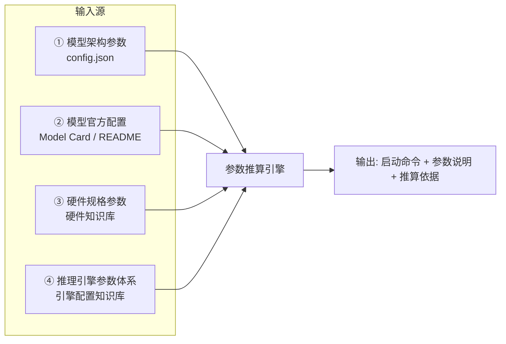

#### 4.1.2 核心推算逻辑

**Step 1：确定计算精度（dtype）**

- 优先使用模型原生精度（如 BF16）。
- 若硬件不支持 BF16（如沐曦 N260），自动降级为 FP16。
- 若降级后显存仍不足，推荐量化方案（优先级：AWQ > GPTQ > INT8 动态量化）。
- Model Card 明确推荐的精度优先级最高。

**Step 2：确定并行策略与卡数**

```
输入:
  weight_memory    = 模型权重显存占用(GB)
  kv_per_token     = 单 Token KV Cache 占用(Bytes)
  mem_per_card     = 单卡显存(GB)
  max_cards_node   = 单节点最大卡数
  gpu_util         = 显存利用率(默认 0.9)

推算:
  // 1. 最少卡数（仅装下权重）
  min_cards = CEIL(weight_memory / (mem_per_card × gpu_util))

  // 2. 对齐到有效 TP 值（须整除 num_attention_heads）
  valid_tp = [t for t in [1,2,4,8] if num_attention_heads % t == 0]
  tensor_parallel = MIN(t for t in valid_tp if t >= min_cards)

  // 3. 判断是否跨节点
  IF tensor_parallel > max_cards_node:
      pipeline_parallel = CEIL(tensor_parallel / max_cards_node)
      tensor_parallel = max_cards_node
      部署模式 = "分布式推理"
  ELSE:
      pipeline_parallel = 1
      部署模式 = "单机部署"
```

**Step 3：推算上下文长度（max-model-len）**

```
  available_memory = (tensor_parallel × mem_per_card × gpu_util) - weight_memory
  max_kv_memory    = available_memory × 0.85
  max_model_len    = MIN(max_position_embeddings, FLOOR(max_kv_memory / kv_per_token / concurrency))

  // Model Card 推荐值对比
  IF model_card_recommended_len:
      max_model_len = MIN(max_model_len, model_card_recommended_len)
```

**Step 4：推算吞吐参数**

| 参数 | 推算逻辑 |
|:--|:--|
| `max-num-batched-tokens` | 受限于 KV Cache 总容量 |
| `max-num-seqs` | 默认 256，显存紧张时按比例降低 |
| `gpu-memory-utilization` | 默认 0.9；国产卡稳定性考虑可降至 0.85 |
| `enforce-eager` | 国产卡不支持 CUDA Graph 时自动设为 true |

**Step 5：合并 Model Card 推荐参数**

- 不冲突 → 合并（Model Card 补充系统推算）。
- 冲突且 Model Card 更保守 → 采用 Model Card 值。
- 冲突且系统推算更保守 → 采用系统推算值，标注差异。

#### 4.1.3 推理引擎参数映射表

| 通用概念 | vLLM | TGI | MindIE | LMDeploy | FastDeploy |
|:--|:--|:--|:--|:--|:--|
| 张量并行度 | `--tensor-parallel-size` | `--num-shard` | `--npu`(设备数) | `--tp` | `--xpu_ids` |
| 流水线并行度 | `--pipeline-parallel-size` | 不支持 | `--pp` | `--pp` | 不支持 |
| 最大序列长度 | `--max-model-len` | `--max-total-tokens` | `--max-seq-len` | `--session-len` | `--max-seq-len` |
| 最大批处理 | `--max-num-batched-tokens` | `--max-batch-total-tokens` | `--max-batch-size` | `--max-batch-size` | `--max-batch-size` |
| 显存利用率 | `--gpu-memory-utilization` | 不可配 | 不可配 | `--cache-max-entry-count` | 不可配 |
| 计算精度 | `--dtype` | `--dtype` | `--dtype` | `--model-format` | `--dtype` |

#### 4.1.4 推算结果对比示例

同一模型 **Qwen2.5-72B-Instruct** 在不同硬件上的推算结果：

| 参数 | H100 80G ×4 | 910B3 ×4 | 910B4 ×4 | 910C ×2 | K100_AI ×4 | C500 ×4 | N260 ×8 |
|:--|:--|:--|:--|:--|:--|:--|:--|
| dtype | bf16 | bf16 | bf16 | bf16 | fp16 | fp16 | int4(AWQ) |
| TP | 4 | 4 | 4 | 2 | 4 | 4 | 8 |
| max-model-len | 65536 | 32768 | 32768 | 65536 | 32768 | 32768 | 8192 |
| max-num-seqs | 128 | 24 | 32 | 64 | 32 | 32 | 16 |
| gpu-mem-util | 0.90 | 0.90 | 0.90 | 0.90 | 0.90 | 0.85 | 0.85 |
| enforce-eager | false | true | true | 待确认 | true | true | true |
| 推理引擎 | vLLM | MindIE | MindIE | MindIE 2.0 | vLLM-DCU | MACA-vLLM | MACA-vLLM |

---

### 4.2 硬件知识库

硬件知识库是全部自动化决策的核心数据基座。

#### 4.2.1 知识库结构

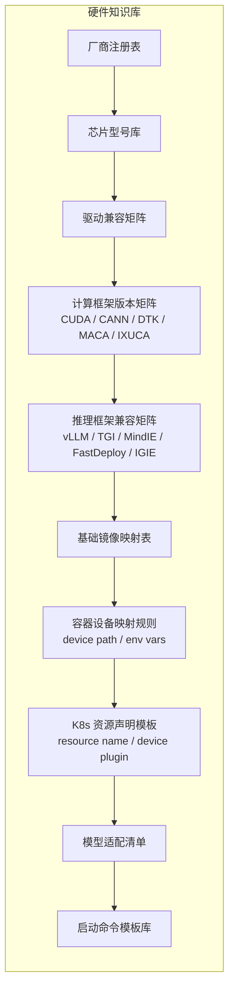

#### 4.2.2 国产厂商硬件型号明细

**华为昇腾 Ascend**

| 芯片型号 | 单卡显存 | 算力(FP16) | 互联 | 互联带宽 | CANN 最低版本 | 推荐引擎 |
|:--|:--|:--|:--|:--|:--|:--|
| 910B3 | 64 GB HBM2e | 280 TFLOPS | HCCS | 56 GB/s | 7.0 | MindIE 1.0 / vLLM-Ascend |
| 910B4 | 64 GB HBM2e | 320 TFLOPS | HCCS | 56 GB/s | 8.0.RC2 | MindIE 1.0 / vLLM-Ascend |
| 910C | 128 GB HBM3 | 400+ TFLOPS | HCCS | 112 GB/s | 8.1+(预计) | MindIE 2.0(预计) |

| 适配资源 | URL |
|:--|:--|
| 昇腾社区 | https://www.hiascend.com/ |
| 昇腾 ModelZoo | https://gitee.com/ascend/ModelZoo-PyTorch |
| MindIE 文档 | 昇腾文档中心 |

**海光 DCU**

| 芯片型号 | 单卡显存 | 算力(FP16) | 互联 | 互联带宽 | DTK 最低版本 | 推荐引擎 |
|:--|:--|:--|:--|:--|:--|:--|
| K100_AI | 64 GB HBM2e | 200 TFLOPS | PCIe 5.0 | 128 GB/s | 24.04 | vLLM-DCU / TGI-DCU |

| 适配资源 | URL |
|:--|:--|
| 光合开发者社区 | https://developer.sourcefind.cn/ |
| 光合 ModelZoo | https://developer.sourcefind.cn/codes/modelzoo/ |

**沐曦 MetaX**

| 芯片型号 | 单卡显存 | 算力(FP16) | 互联 | 互联带宽 | MACA 最低版本 | 推荐引擎 |
|:--|:--|:--|:--|:--|:--|:--|
| N260 | 32 GB GDDR6 | 100 TFLOPS | PCIe 4.0 | 64 GB/s | 2.0 | MACA-vLLM(轻量) |
| C500 | 64 GB HBM2e | 200 TFLOPS | PCIe 5.0 | 128 GB/s | 2.0 | MACA-vLLM |
| C550 | 64 GB HBM2e | 250 TFLOPS | PCIe 5.0 | 128 GB/s | 2.5(预计) | MACA-vLLM |

| 适配资源 | URL |
|:--|:--|
| 沐曦开发者中心 | https://www.metax-tech.com/ |

**百度昆仑芯 Kunlunxin**

| 芯片型号 | 单卡显存 | 算力(FP16) | 互联 | 推荐引擎 |
|:--|:--|:--|:--|:--|
| R200 | 32/64 GB | 256 TFLOPS | PCIe 5.0 | FastDeploy / xpu-llm |
| R300 | 64 GB HBM | 300+ TFLOPS | PCIe 5.0 | FastDeploy |

| 适配资源 | URL |
|:--|:--|
| 昆仑芯官网 | https://www.kunlunxin.com/ |

**天数智芯 Iluvatar**

| 芯片型号 | 单卡显存 | 算力(FP16) | 互联 | 推荐引擎 |
|:--|:--|:--|:--|:--|
| BI-150 | 32 GB | 200 TFLOPS | PCIe 4.0 | IGIE / IX-vLLM |
| MR-V100 | 16/32 GB | 150 TFLOPS | PCIe 4.0 | IGIE |

| 适配资源 | URL |
|:--|:--|
| 天数智芯官网 | https://www.iluvatar.com/ |

#### 4.2.3 容器化适配规则总表

| 厂商 | 设备映射 | 环境变量 | K8s 资源声明 | K8s 设备插件 | 设备检测命令 |
|:--|:--|:--|:--|:--|:--|
| NVIDIA | `--gpus '"device=0,1"'` | `CUDA_VISIBLE_DEVICES` | `nvidia.com/gpu: N` | nvidia-device-plugin | `nvidia-smi` |
| 昇腾 | `--device /dev/davinci*` | `ASCEND_VISIBLE_DEVICES` | `huawei.com/Ascend910: N` | ascend-device-plugin | `npu-smi info` |
| 海光 | `--device /dev/kfd --device /dev/dri` | `HIP_VISIBLE_DEVICES` | `hygon.com/dcu: N` | hygon-dcu-device-plugin | `rocm-smi` |
| 沐曦 | `--device /dev/mxgpu*` | `MACA_VISIBLE_DEVICES` | `metax.com/gpu: N` | metax-device-plugin | `mx-smi` |
| 昆仑芯 | `--device /dev/xpu* --device /dev/xpuctrl` | `XPU_VISIBLE_DEVICES` | `baidu.com/xpu: N` | kunlunxin-device-plugin | `xpu_smi` |
| 天数 | `--device /dev/ixgpu*` | `IX_VISIBLE_DEVICES` | `iluvatar.com/gpu: N` | iluvatar-device-plugin | `ixsmi` |

#### 4.2.4 知识库运维规则

- 数据格式：YAML/JSON，支持导入导出，便于版本管理。
- 每条规则记录：来源（`official-verified` / `official-inferred` / `user-provided` / `community`）、验证状态、更新时间。
- 同步策略：每日从各厂商官方源自动同步最新适配信息，支持手动触发。
- 探索模式：知识库无匹配时，基于同系列通用配置尝试构建，将结果回写知识库。

---

### 4.3 OpenAI 兼容 API 封装

#### 4.3.1 触发条件

在旅程三镜像构建阶段，系统检查推理引擎的 HTTP 服务能力：

| 推理引擎 | 原生 OpenAI 兼容 API | 是否需要注入 |
|:--|:--|:--|
| vLLM | ✅ 支持 | 不需要 |
| TGI | ✅ 支持（兼容接口） | 不需要 |
| MindIE | ✅ 支持 | 不需要 |
| LMDeploy | ✅ 支持 | 不需要 |
| 原生 transformers | ❌ 仅 Python API | **需要注入** |
| 部分国产卡专用框架 | ❌ 仅 gRPC / Python | **需要注入** |
| FastDeploy | 部分支持 | 按版本判断 |
| IGIE | 需确认 | 按版本判断 |

#### 4.3.2 自动注入规格

系统自动生成的 FastAPI 服务需包含以下接口：

| 接口 | Method | Path | 说明 |
|:--|:--|:--|:--|
| 对话补全 | POST | `/v1/chat/completions` | 支持流式(SSE) & 非流式 |
| 文本补全 | POST | `/v1/completions` | 标准补全接口 |
| 模型列表 | GET | `/v1/models` | 返回已部署模型名称 |
| Embedding | POST | `/v1/embeddings` | 若模型支持 |
| 健康检查 | GET | `/health` | 服务健康状态 |

**规格约束**：
- 请求/响应格式严格遵循 OpenAI API Reference。
- 流式输出使用 SSE，`data: [DONE]` 标记结束。
- Chat Template 从模型 `tokenizer_config.json` 自动加载，不硬编码。
- 支持参数：`temperature`、`top_p`、`max_tokens`、`stop`、`stream`、`n`。
- FastAPI 包装层额外延迟 ≤ 5ms（P99）。
- 并发请求数 ≥ 100（通过 uvicorn worker 配置）。
- 推理框架能力矩阵维护在配置文件中，新增框架只需更新配置。

---

## 5. 非功能性需求

### 5.1 性能需求

| 领域 | 指标项 | 指标说明 | 目标规格 |
|:--|:--|:--|:--|
| 模型下载 | 下载速度 | 单文件下载（网络非瓶颈时） | ≥ 100 MB/s |
| 模型下载 | 断点续传恢复 | 中断后重新开始下载的耗时 | < 5s |
| 信息解析 | 模型信息解析 | 旅程一整体解析时间 | < 30s |
| 镜像构建 | 构建耗时 | 含推理框架安装（不含权重 COPY） | < 10min |
| 环境预检 | 预检耗时 | 全项检查完成 | < 30s |
| 部署 | Docker 单实例部署 | 从点击部署到容器 Running | < 60s（不含镜像拉取） |
| 部署 | K8s Pod 调度 | 从 apply 到 Pod Running | < 120s（不含镜像拉取） |
| API 封装 | FastAPI 额外延迟 | 包装层引入的 overhead | < 5ms (P99) |
| 平台 UI | 页面渲染时间 | 所有管理页面 | < 1s |
| 平台 API | API 响应延时 | 95% 请求 | < 200ms |

### 5.2 安全与合规

| 安全要求 | 说明 |
|:--|:--|
| 凭证加密 | SSH 密钥、kubeconfig、镜像仓库密码使用 AES-256 加密存储 |
| 传输加密 | 平台与目标环境之间通信使用 TLS 1.2+ |
| 操作审计 | 关键操作（下载、构建、部署、删除）记录日志，保留 180 天 |
| 权限控制 | RBAC：管理员（管理知识库+环境）、普通用户（使用部署功能） |
| 模型安全 | SHA256 校验权重文件，防篡改 |
| 网络隔离 | 支持配置代理（HTTP_PROXY）访问外部模型源，推理服务仅内网访问 |

### 5.3 兼容性

| 维度 | 要求 |
|:--|:--|
| GPU 硬件 | NVIDIA (Ampere+)、昇腾 910B3/910B4/910C、海光 K100_AI、沐曦 N260/C500/C550、昆仑芯 R200/R300、天数 BI-150/MR-V100 |
| 容器运行时 | Docker Engine 20.10+、containerd 1.6+ |
| K8s 版本 | 1.24+ |
| 操作系统 | Ubuntu 20.04/22.04、CentOS 7.9/8、openEuler 22.03（昇腾推荐） |
| 浏览器 | Chrome 90+、Edge 90+（管理 UI） |

---

## 6. 标准化接口需求（平台管理 API）

| 接口功能 | Method & Path | 详细说明 |
|:--|:--|:--|
| 创建适配任务 | `POST /api/v1/tasks` | 入参：model_id, hardware, engine(可选) |
| 获取适配任务详情 | `GET /api/v1/tasks/{task_id}` | 返回任务全状态（含四个旅程进度） |
| 模型信息解析 | `POST /api/v1/models/parse` | 入参：model_id/url，返回模型元数据 |
| 下载模型权重 | `POST /api/v1/models/download` | 入参：model_id, source, target(local/remote), path |
| 下载进度查询 | `GET /api/v1/models/download/{task_id}` | 返回进度百分比、速度、ETA |
| 生成推理镜像 | `POST /api/v1/images/build` | 入参：task_id, framework, dtype, pack_mode |
| 构建状态查询 | `GET /api/v1/images/build/{build_id}` | 返回状态及日志流 |
| 参数推算 | `POST /api/v1/params/calculate` | 入参：model_config, hardware, engine；返回推荐参数集 |
| 参数重算 | `PUT /api/v1/params/calculate` | 入参：用户调整的参数；返回联动更新后的参数集 |
| 环境预检 | `POST /api/v1/environments/precheck` | 入参：env_id, deploy_requirements |
| 执行部署 | `POST /api/v1/deployments` | 入参：task_id, env_id, deploy_mode, gpu_config |
| 部署状态查询 | `GET /api/v1/deployments/{deploy_id}` | 返回状态、容器/Pod 状态、API Endpoint |
| 部署验证 | `POST /api/v1/deployments/{deploy_id}/verify` | 触发自动验证 |
| 硬件知识库查询 | `GET /api/v1/hardware/compatibility` | 查询硬件-模型-框架兼容矩阵 |
| 硬件知识库更新 | `PUT /api/v1/hardware/compatibility` | 更新/新增适配规则 |
| 环境管理 | `POST /api/v1/environments` | 注册新的目标环境 |
| 环境列表 | `GET /api/v1/environments` | 返回已注册环境列表 |

---

## 7. 平台自身部署要求

> 本章描述的是 **LLM Deploy 工具本身** 如何部署到用户环境，而非工具所管理的模型推理服务的部署。

### 7.1 部署模式概述

LLM Deploy 工具支持两种部署模式，以适应不同客户场景：

| 部署模式 | 适用场景 | 优势 | 限制 |
|:--|:--|:--|:--|
| **本地电脑部署** | 个人开发验证、小团队试用、离线评估 | 零依赖快速启动，无需额外基础设施 | 单用户使用，下载/构建受本地资源限制 |
| **客户侧服务端部署（Docker/K8s）** | 团队协作、生产环境、持续运维 | 多用户共享，就近操作目标环境，消除文件中转 | 需要客户提供 Docker/K8s 基础设施 |

**核心设计原则：将工具部署到离目标 GPU/NPU 硬件最近的位置，实现"就近拉取、就近构建、就近部署"，消除文件远程传输和中转的时间损耗。**

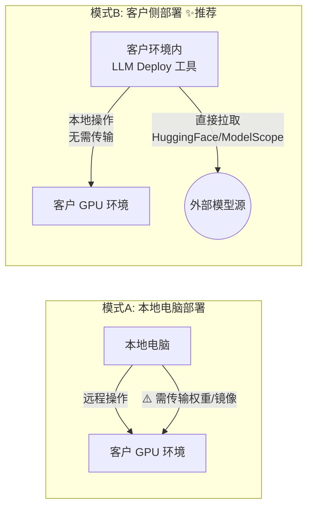

### 7.2 模式A：本地电脑部署

#### 7.2.1 部署方式

支持以下三种本地启动方式（用户任选其一）：

| 方式 | 启动命令 | 适用人群 |
|:--|:--|:--|
| **Docker 一键启动** | `docker run -d -p 8080:8080 llm-deploy/platform:latest` | 推荐，最简单 |
| **Docker Compose** | `docker compose up -d` | 需要持久化数据 |
| **Python 直接运行** | `pip install llm-deploy && llm-deploy serve` | 开发者 / 定制化需求 |

#### 7.2.2 最低系统要求

| 项目 | 要求 |
|:--|:--|
| 操作系统 | Windows 10+、macOS 12+、Ubuntu 20.04+ |
| CPU | 4 核+ |
| 内存 | 8 GB+（仅平台运行，不含模型推理） |
| 磁盘 | 50 GB+（存储模型权重需额外空间） |
| Docker（若使用容器方式） | Docker Desktop 4.0+ 或 Docker Engine 20.10+ |
| 网络 | 可访问 HuggingFace / ModelScope；可 SSH 到目标 GPU 环境 |

#### 7.2.3 与远程环境的协作方式

本地部署模式下，工具通过远程连接操作客户 GPU 环境：

| 操作 | 连接方式 | 说明 |
|:--|:--|:--|
| 模型权重下载 | SSH + 远程执行下载命令 | 在远程环境直接拉取，不经本地中转 |
| 镜像构建 | SSH + 远程 Docker Build | 在远程环境直接构建 |
| 环境预检 | SSH 采集信息 | 远程执行检测命令 |
| 部署启动 | SSH + Docker/kubectl 命令 | 远程执行部署 |
| 镜像推送 | 本地 build → docker push → 远程 pull | 需镜像仓库中转（或直接远程构建） |

> **关键优化**：即使本地部署，也优先采用"远程直接拉取"策略，即通过 SSH 在目标环境直接执行 `huggingface-cli download` 或 `modelscope download`，避免先下载到本地再传输的双倍耗时。

### 7.3 模式B：客户侧服务端部署（推荐）

#### 7.3.1 核心优势

将 LLM Deploy 工具部署在客户的 Docker 或 K8s 环境内，与目标 GPU/NPU 环境同网络，实现：

| 优势 | 说明 |
|:--|:--|
| **零传输部署** | 模型权重、推理镜像在同一内网直接拉取/构建/部署，无需跨网传输 |
| **网络加速** | 可配置客户内网的镜像仓库代理 / HuggingFace 镜像站，充分利用内网带宽 |
| **多用户协作** | 团队共享同一平台实例，共用已下载模型和已构建镜像，避免重复工作 |
| **持续运维** | 部署在服务端长期运行，支持任务队列、定时同步知识库、服务监控 |
| **安全合规** | 模型文件不出客户网络，符合数据安全要求 |

#### 7.3.2 Docker 部署方式

**最小化部署（单容器）**：

```bash
docker run -d \
  --name llm-deploy \
  -p 8080:8080 \
  -v /data/llm-deploy/data:/app/data \
  -v /var/run/docker.sock:/var/run/docker.sock \
  -v ~/.kube/config:/root/.kube/config:ro \
  llm-deploy/platform:latest
```

**完整部署（docker-compose）**：

```yaml
# docker-compose.yml — LLM Deploy 平台部署
version: '3.8'
services:
  platform:
    image: llm-deploy/platform:latest
    ports:
      - "8080:8080"
    volumes:
      - ./data:/app/data                          # 持久化数据（任务、知识库、配置）
      - /data/models:/data/models                 # 模型权重共享存储
      - /var/run/docker.sock:/var/run/docker.sock  # Docker 操作权限
      - ~/.kube/config:/root/.kube/config:ro       # K8s 集群访问（可选）
    environment:
      - DATABASE_URL=postgresql://postgres:password@db:5432/llm_deploy
      - MODEL_STORAGE_PATH=/data/models
      - HTTP_PROXY=${HTTP_PROXY}                   # 代理配置（可选）
      - HTTPS_PROXY=${HTTPS_PROXY}
    restart: unless-stopped

  db:
    image: postgres:15-alpine
    volumes:
      - pgdata:/var/lib/postgresql/data
    environment:
      - POSTGRES_DB=llm_deploy
      - POSTGRES_PASSWORD=password

volumes:
  pgdata:
```

#### 7.3.3 K8s 部署方式

提供 Helm Chart 或标准 K8s YAML 清单，一键部署到客户 K8s 集群：

**Helm 安装**：
```bash
helm repo add llm-deploy https://charts.llm-deploy.io
helm install llm-deploy llm-deploy/platform \
  --namespace llm-deploy --create-namespace \
  --set storage.modelPath=/data/models \
  --set ingress.enabled=true \
  --set ingress.host=llm-deploy.internal.company.com
```

**K8s YAML 关键资源**：

| 资源类型 | 说明 |
|:--|:--|
| Deployment | 平台主服务（1-3 副本） |
| Service | ClusterIP / NodePort / LoadBalancer |
| Ingress | 可选，提供域名访问 |
| PVC | 模型权重存储（建议 NFS/Ceph 共享存储，多节点共享） |
| ConfigMap | 平台配置（代理、镜像仓库地址、知识库同步策略） |
| Secret | 数据库密码、SSH 密钥、镜像仓库凭证 |
| ServiceAccount + RBAC | 操作目标命名空间的 Pod/Deployment/Service 权限 |

**K8s 部署时的权限要求**：

| 权限 | 用途 | 范围 |
|:--|:--|:--|
| 创建/删除 Pod、Deployment、StatefulSet | 部署模型推理服务 | 目标命名空间 |
| 创建/删除 Service、ConfigMap | 暴露推理服务 | 目标命名空间 |
| 读取 Node 信息 | 环境预检（查询 GPU/NPU 设备） | 集群级别（只读） |
| 管理 PVC | 模型权重存储 | 目标命名空间 |

#### 7.3.4 就近拉取策略（消除文件中转）

**核心思路**：LLM Deploy 工具部署在客户环境内后，所有文件操作均在客户内网完成，无需经过外部网络中转。

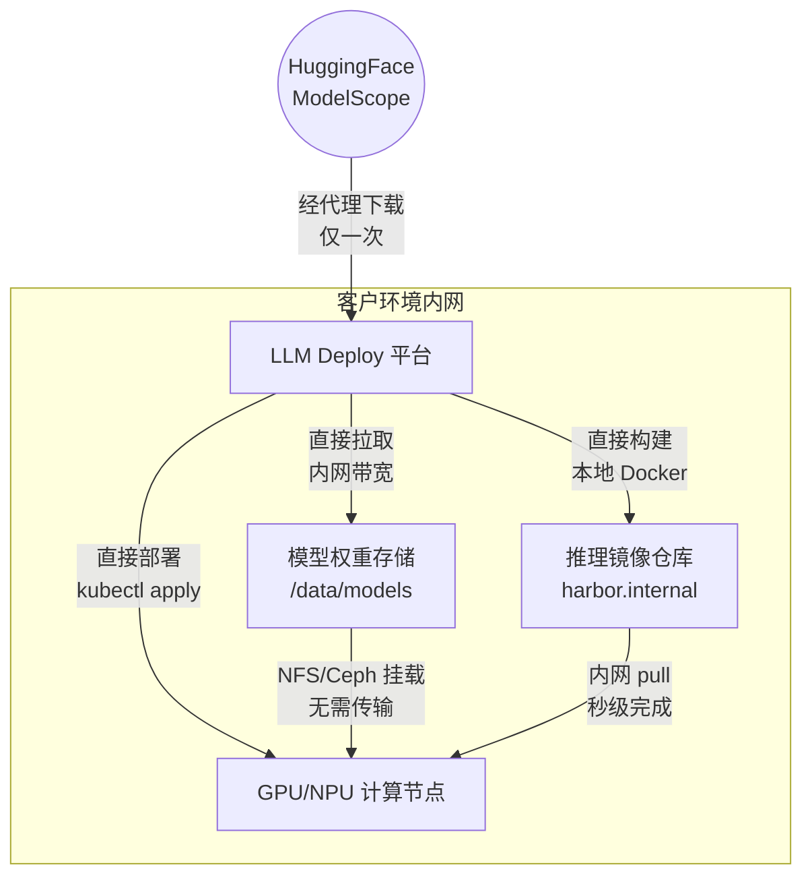

**就近操作的具体实现**：

| 旅程 | 传统方式（远程中转） | 就近方式（客户侧部署） |
|:--|:--|:--|
| 旅程二：权重下载 | 本地下载 → scp 传到服务器 | 直接在客户环境内下载到共享存储 |
| 旅程三：镜像构建 | 本地 build → docker save → 传输 → docker load | 直接在客户环境内 build → push 到内部镜像仓库 |
| 旅程四：部署启动 | 远程 SSH 执行命令 | 本地 kubectl apply / docker run |

**节省时间估算**：

| 操作 | 远程中转耗时 | 就近操作耗时 | 节省 |
|:--|:--|:--|:--|
| 下载 70B 模型权重（140GB） | 下载 30min + 传输 60min = **90min** | 直接下载 **30min** | 60min (67%) |
| 传输推理镜像（15GB） | docker save 5min + 传输 15min + load 5min = **25min** | 内网 push+pull **2min** | 23min (92%) |
| 总计（单次完整部署） | **~120min** | **~35min** | **~85min (71%)** |

### 7.4 部署说明文件交付物

为简化客户侧部署，需提供以下标准化交付文件：

#### 7.4.1 交付物清单

| 文件 | 格式 | 说明 |
|:--|:--|:--|
| `README-DEPLOY.md` | Markdown | 部署总览指南，含快速启动命令 |
| `docker-compose.yml` | YAML | Docker Compose 一键部署配置 |
| `helm-chart/` | Helm Chart 目录 | K8s Helm 部署包 |
| `k8s-manifests/` | YAML 目录 | 纯 K8s YAML 清单（无 Helm 场景） |
| `env.example` | ENV | 环境变量模板（含注释说明） |
| `offline-install.sh` | Shell 脚本 | 离线环境安装脚本（含依赖打包） |
| `images/` | tar.gz | 离线镜像包（平台镜像 + 基础推理引擎镜像） |
| `UPGRADE.md` | Markdown | 版本升级指南 |
| `FAQ.md` | Markdown | 常见问题排障手册 |

#### 7.4.2 部署指南结构（README-DEPLOY.md）

```
部署指南目录：

1. 环境准备
   1.1 最低系统要求
   1.2 网络要求（可访问 HuggingFace/ModelScope 或配置镜像站）
   1.3 存储规划（模型权重存储建议 ≥ 1TB）

2. 快速部署
   2.1 Docker 一键部署（3 步完成）
   2.2 K8s Helm 部署（3 步完成）
   2.3 离线环境部署

3. 配置说明
   3.1 环境变量参考
   3.2 网络代理配置
   3.3 内网镜像仓库对接
   3.4 共享存储配置（NFS/Ceph/JuiceFS）
   3.5 GPU/NPU 节点标签配置

4. 验证部署
   4.1 访问管理界面
   4.2 执行一个端到端测试（下载小模型 → 构建镜像 → 部署验证）

5. 运维手册
   5.1 备份与恢复
   5.2 日志查看
   5.3 版本升级
```

#### 7.4.3 离线部署方案

针对无外网访问的客户环境，提供完整离线部署能力：

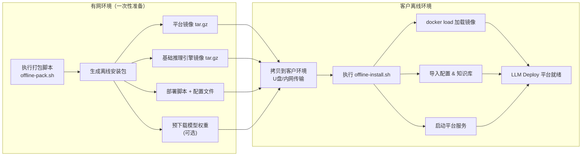

**离线安装脚本（offline-install.sh）核心流程**：
1. 检测目标环境 Docker/K8s 版本。
2. `docker load` 加载平台镜像和预置推理引擎镜像。
3. 导入硬件知识库（离线快照版本）。
4. 生成默认配置文件。
5. 启动平台服务。
6. 输出访问地址和初始管理员账号。

### 7.5 部署模式对四大旅程的影响

| 旅程 | 本地电脑部署 | 客户侧 Docker/K8s 部署 |
|:--|:--|:--|
| **旅程一：模型适配登记** | 无差异 | 无差异 |
| **旅程二：模型权重下载** | 可下载到本地或 SSH 远程下载到目标环境 | **直接下载到共享存储，GPU 节点通过 NFS/PVC 挂载，零传输** |
| **旅程三：推理引擎镜像生成** | 本地构建后需推送到远程镜像仓库 | **直接在客户环境内构建，push 到内网镜像仓库，秒级可用** |
| **旅程四：部署与启动** | 通过 SSH 远程执行 docker run / kubectl apply | **直接操作本地 Docker / K8s API，更稳定更快速** |
| **文件传输开销** | 需要传输权重文件和镜像文件（可能 100GB+） | **无传输，全部就近操作** |
| **网络依赖** | 需稳定的 SSH 连接到客户环境 | 仅需访问 HuggingFace/ModelScope（可配代理） |

### 7.6 共享存储与缓存策略

客户侧部署时，推荐配置共享存储以实现 **"一次下载、多节点共享"**：

| 存储类型 | 推荐方案 | 说明 |
|:--|:--|:--|
| 模型权重 | NFS / CephFS / JuiceFS | 所有 GPU 节点挂载同一存储，下载一次全节点可用 |
| 推理镜像 | 内网 Harbor / Docker Registry | 构建一次 push 到内部仓库，所有节点可 pull |
| 构建缓存 | 本地磁盘 + Docker BuildKit Cache | 重复构建时复用已有 layer，加速构建 |
| 知识库 | 平台内置数据库（PostgreSQL） | 随平台部署，自动持久化 |

**缓存命中策略**：

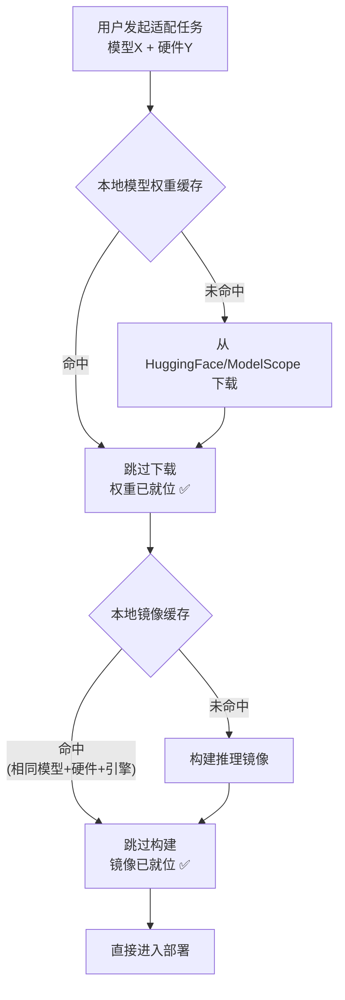

**缓存优化效果**：当团队内多人部署同一模型（或同模型不同硬件），第二人起可跳过已完成的下载/构建步骤，耗时从 30+ 分钟缩短到 **< 2 分钟**（仅部署+验证）。

---

## 附录：全流程总览图

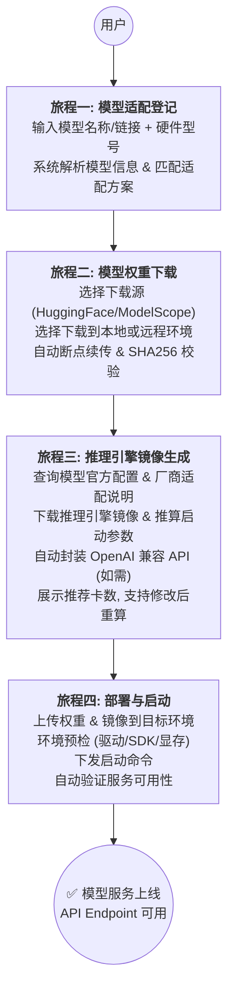

---

*文档结束*
