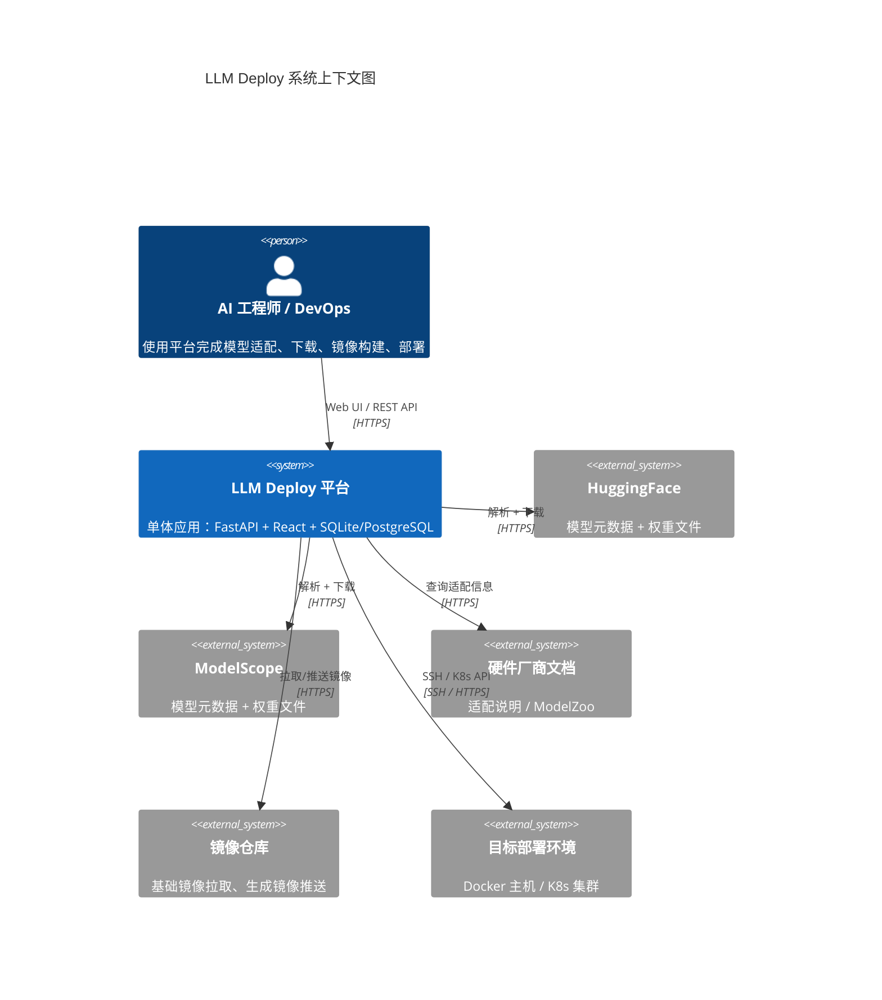
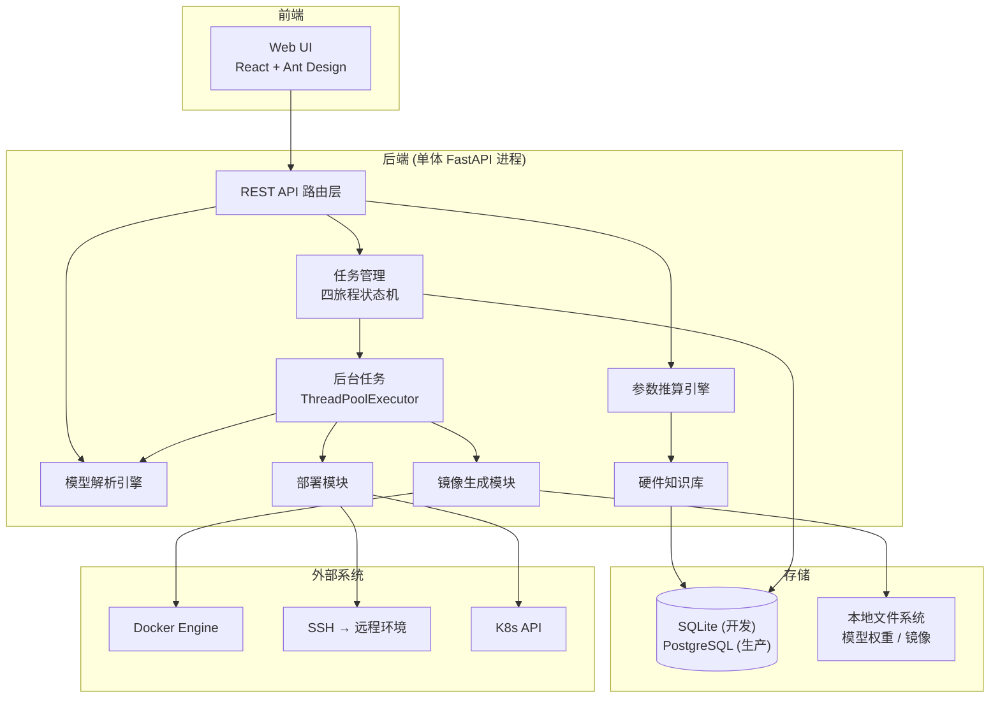
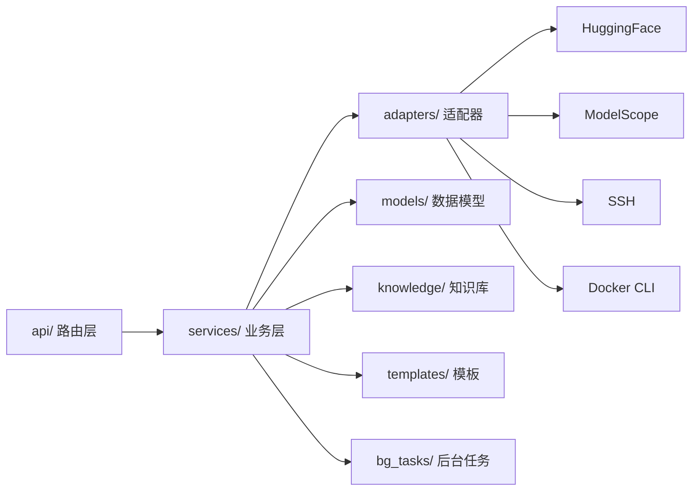
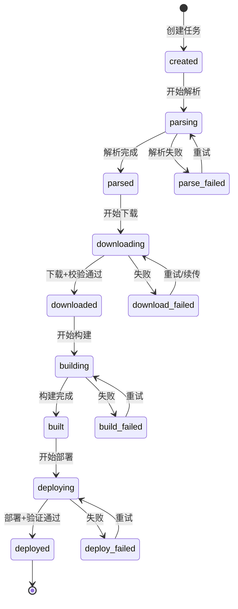
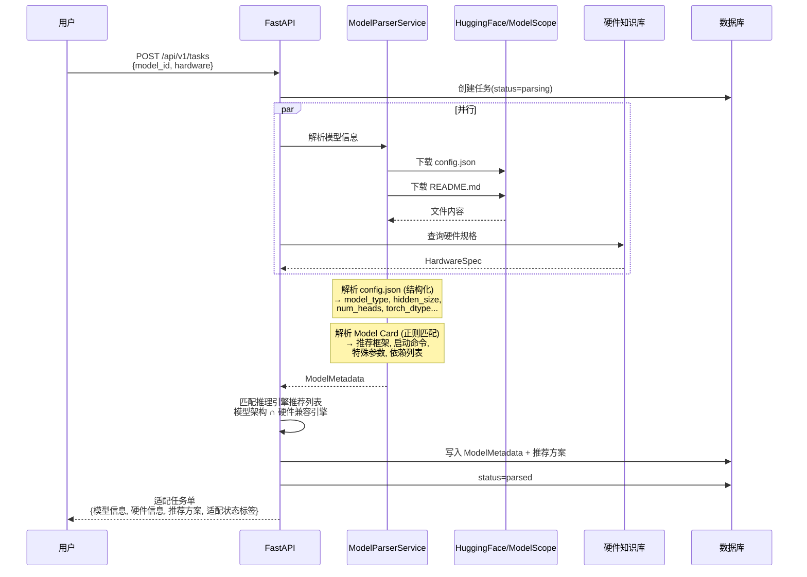
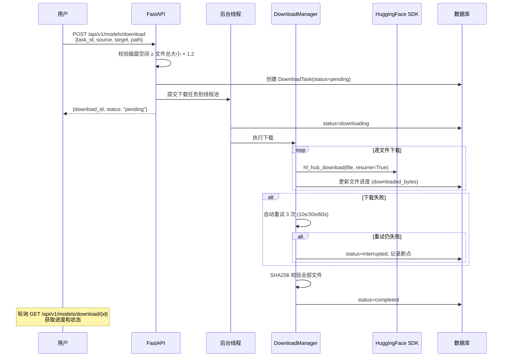
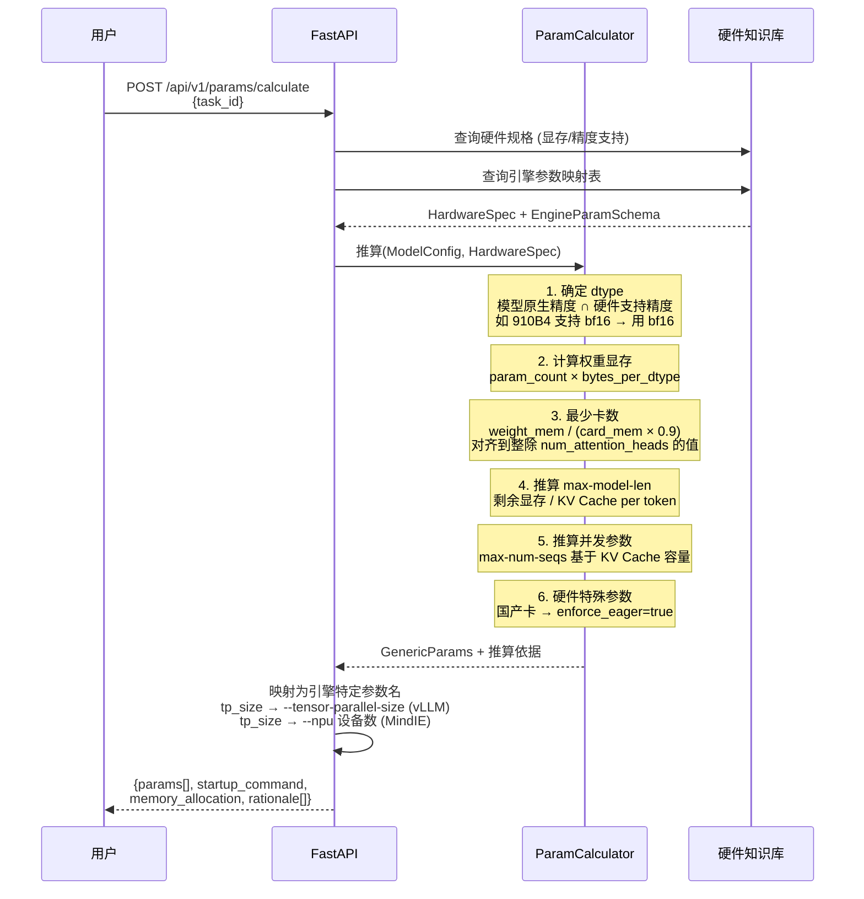
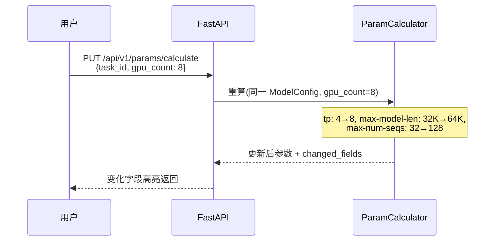
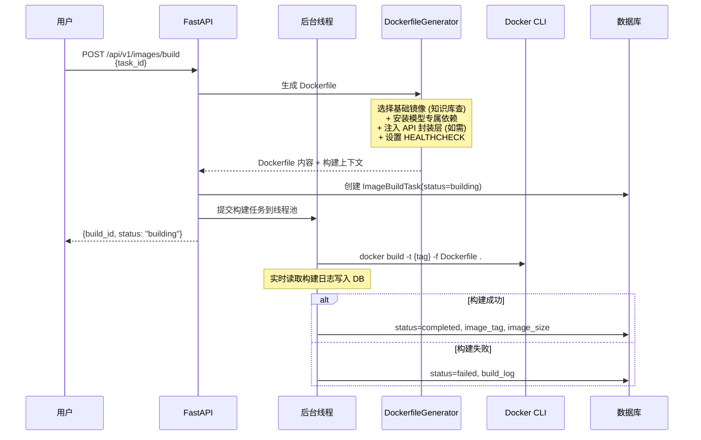
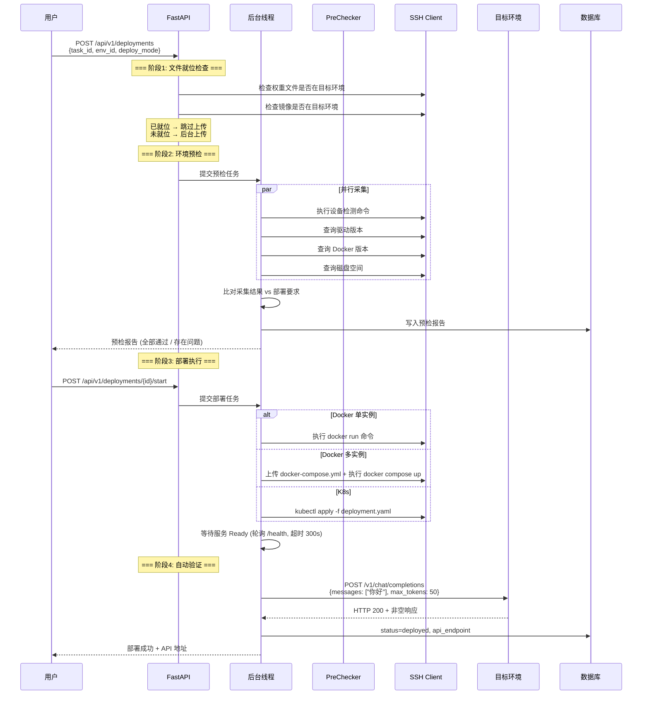

# LLM Deploy — 大模型自助部署平台 系统架构设计文档 (SDD)

| 文档属性 | 内容 |
|:--|:--|
| 产品名称 | LLM Deploy（大模型自助部署平台） |
| 文档类型 | 系统架构设计文档 (System Design Document) |
| 版本 | v1.0 |
| 日期 | 2026-03-01 |
| 状态 | 初稿 |
| 关联 PRD | PRD_LLM_Deploy_大模型自助部署平台_v1.0.md |

---

## 目录

- [1. 系统综述](#1-系统综述)
- [2. 技术栈选型](#2-技术栈选型)
- [3. 模块划分与代码结构](#3-模块划分与代码结构)
- [4. 四旅程主流程设计](#4-四旅程主流程设计)
- [5. 数据模型](#5-数据模型)
- [6. 部署方案](#6-部署方案)
- [7. 演进规划](#7-演进规划)

---

## 1. 系统综述

### 1.1 设计边界

v1.0 的目标是 **跑通四旅程主流程**，以下能力降低优先级：

| 能力 | v1.0 处理方式 |
|:--|:--|
| 多租户 | 不做，单租户 |
| RBAC 权限 | 不做独立权限模型，user 表 `role` 字段区分 admin/user |
| MCP Server | 不做，REST API 先行，架构上预留接入点 |
| 审计日志 | 结构化日志输出到文件（Python logging），不建独立表 |
| CI/CD 流水线 | 手动 `docker build` + `docker compose up`，不设计自动化流水线 |
| 灰度/零停机部署 | 不做，直接重启容器 |
| 动态发现未知硬件 | 不做自动爬取，提供手动录入表单 |

### 1.2 架构概览 (C4 Context)



### 1.3 设计原则

| 原则 | 说明 |
|:--|:--|
| **主流程优先** | 先跑通 "输入模型+硬件 → 部署出 API Endpoint" 全链路，再补边界场景 |
| **API First** | 所有功能通过 REST API 暴露，Web UI 是 API 消费者 |
| **知识驱动** | 硬件适配、参数推算由知识库数据驱动，新增硬件/引擎只需加数据 |
| **单体起步** | 一个 FastAPI 进程搞定全部逻辑，后台任务用线程池 |
| **幂等可重试** | 每个旅程步骤可安全重试，下载断点续传，构建复用缓存 |

### 1.4 整体架构



**关键简化**：
- **无 Redis**：解析结果缓存用 `cachetools.TTLCache`（进程内内存，TTL 24h），下载进度直接写 DB。
- **无 Celery**：长时任务（下载/构建/部署）提交到 `concurrent.futures.ThreadPoolExecutor`，状态持久化到 DB，进程重启后可通过 DB 状态恢复。
- **无独立消息队列**：任务间通过 DB 状态流转 + 轮询驱动。

---

## 2. 技术栈选型

### 2.1 选型总表

| 领域 | 选型 | 备选 | 选择理由 |
|:--|:--|:--|:--|
| **后端** | Python 3.11 + FastAPI | Go / Java | `huggingface_hub` 和 `modelscope` SDK 是 Python 原生，用其他语言需要大量胶水代码 |
| **前端** | React 18 + TypeScript + Ant Design | Vue3 | Ant Design ProComponents 适配 B 端表单场景（任务单、参数表、预检报告） |
| **数据库** | SQLite (开发) / PostgreSQL (生产) | MySQL | SQLite 零配置开发体验好；PostgreSQL JSONB 支持知识库半结构化数据 |
| **ORM** | SQLAlchemy 2.0 + Alembic | SQLModel | 生态最成熟，Alembic 迁移完善 |
| **后台任务** | ThreadPoolExecutor | Celery / ARQ | 当前 < 10 并发任务，线程池足够；省掉 Redis + Broker 两个外部依赖 |
| **缓存** | cachetools.TTLCache (进程内) | Redis | 单进程部署，内存缓存够用；省掉 Redis 部署运维 |
| **容器操作** | subprocess 调用 Docker CLI | docker-py SDK | CLI 调用更直观、调试更简单、日志流重定向方便 |
| **K8s 操作** | subprocess 调用 kubectl | kubernetes-client | 生成 YAML + `kubectl apply` 比 SDK 更透明，出错时用户可手动排查 |
| **SSH** | Paramiko | asyncssh / Fabric | 功能完整，同步接口在线程池中使用不需要 async |

### 2.2 为什么不用 Celery + Redis

| 维度 | Celery + Redis | ThreadPoolExecutor |
|:--|:--|:--|
| 额外依赖 | Redis 服务 + Celery worker 进程 | 无，Python 标准库 |
| 部署复杂度 | 3 个容器（app + worker + redis） | 1 个容器 |
| 任务持久化 | Celery 内置 | 自行写 DB（简单，主流程就这几个任务） |
| 进程重启恢复 | Celery 自动重投 | 启动时扫描 DB 中 `status=running` 的任务，标记为 `interrupted` 供用户手动重试 |
| 适用规模 | 100+ 并发任务 | **< 10 并发任务（完全够用）** |
| 演进路径 | - | 未来需要时加 Celery，任务接口不变（只改提交方式） |

---

## 3. 模块划分与代码结构

### 3.1 目录结构

```
llm_deploy/
├── main.py                      # FastAPI 启动入口
├── config.py                    # 配置管理 (pydantic-settings)
├── database.py                  # DB 连接 + Session 管理
│
├── api/                         # REST API 路由层
│   ├── tasks.py                 # 适配任务 CRUD + 状态查询
│   ├── models.py                # 模型解析 + 下载
│   ├── images.py                # 镜像构建
│   ├── params.py                # 参数推算 + 重算
│   ├── deployments.py           # 部署 + 预检 + 验证
│   ├── environments.py          # 环境管理
│   └── hardware.py              # 硬件知识库查询
│
├── services/                    # 业务逻辑层
│   ├── task_manager.py          # 四旅程状态机编排
│   ├── model_parser.py          # 模型信息解析 (config.json + Model Card)
│   ├── hardware_matcher.py      # 硬件匹配 + 引擎推荐
│   ├── download_manager.py      # 下载编排 (HF/MS 双源 + 断点续传)
│   ├── param_calculator.py      # 参数推算引擎核心
│   ├── dockerfile_generator.py  # Dockerfile 生成
│   ├── command_builder.py       # 启动命令生成
│   ├── image_builder.py         # Docker build 执行
│   ├── api_wrapper.py           # FastAPI OpenAI 兼容封装注入
│   ├── env_prechecker.py        # 环境预检
│   ├── deployer.py              # 部署执行 (Docker / K8s)
│   └── service_verifier.py      # 服务验证
│
├── adapters/                    # 外部系统适配器 (防腐层)
│   ├── huggingface.py           # HuggingFace API 封装
│   ├── modelscope_adapter.py    # ModelScope API 封装
│   ├── ssh_executor.py          # SSH 远程命令执行
│   └── container/               # 硬件容器适配器
│       ├── base.py              # ContainerAdapter 协议
│       ├── nvidia.py
│       ├── ascend.py
│       ├── hygon.py
│       ├── metax.py
│       ├── kunlunxin.py
│       └── iluvatar.py
│
├── models/                      # SQLAlchemy ORM 模型
│   ├── task.py
│   ├── model_metadata.py
│   ├── download.py
│   ├── image_build.py
│   ├── deployment.py
│   ├── environment.py
│   └── hardware.py
│
├── knowledge/                   # 硬件知识库 (YAML 数据)
│   ├── vendors/
│   │   ├── nvidia.yaml
│   │   ├── huawei_ascend.yaml
│   │   ├── hygon_dcu.yaml
│   │   ├── metax.yaml
│   │   ├── kunlunxin.yaml
│   │   └── iluvatar.yaml
│   ├── engines/                 # 推理引擎参数映射
│   │   ├── vllm.yaml
│   │   ├── mindie.yaml
│   │   ├── lmdeploy.yaml
│   │   ├── fastdeploy.yaml
│   │   └── igie.yaml
│   └── loader.py               # YAML → 内存 + DB 同步
│
├── bg_tasks/                    # 后台任务
│   ├── worker.py                # ThreadPoolExecutor 管理
│   └── tasks.py                 # 具体任务函数 (download / build / deploy)
│
├── templates/                   # 模板文件
│   ├── dockerfiles/             # 各引擎 Dockerfile 模板 (Jinja2)
│   ├── startup_commands/        # 启动命令模板
│   ├── k8s_manifests/           # K8s YAML 模板
│   └── api_wrappers/            # FastAPI 封装代码模板
│
└── frontend/                    # React 前端
    └── ...
```

### 3.2 模块依赖关系



规则：`api/` 只调 `services/`，`services/` 调 `adapters/` + `models/` + `knowledge/`，不允许反向依赖。

### 3.3 硬件容器适配器

核心抽象——每个厂商实现同一接口，知识库数据驱动选择：

```python
# adapters/container/base.py
class ContainerAdapter(Protocol):
    def get_device_args(self, device_ids: list[int]) -> list[str]:
        """返回 docker run 的设备参数列表"""
        ...
    def get_extra_volumes(self) -> list[str]:
        """返回额外挂载卷（如昇腾驱动目录）"""
        ...
    def get_env_vars(self, device_ids: list[int]) -> dict[str, str]:
        """返回设备可见性环境变量"""
        ...
    def get_detection_command(self) -> str:
        """返回设备检测命令（如 nvidia-smi）"""
        ...
```

通过 `vendor slug → Adapter class` 映射表选择具体实现，无需 if-else 分支。

### 3.4 任务状态机

适配任务的顶层状态流转，驱动四个旅程：



状态转移通过 `services/task_manager.py` 统一管理，每次状态变更写 DB + 记日志。

---

## 4. 四旅程主流程设计

### 4.1 旅程一：模型适配登记

#### 主流程时序



#### Model Card 解析策略

v1.0 采用 **正则匹配** 方案（不依赖外部 LLM）：

| 提取内容 | 正则策略 |
|:--|:--|
| 推荐框架 | 匹配关键词 `vllm`、`tgi`、`sglang`、`lmdeploy` |
| 推荐启动命令 | 提取 ` ```bash` / ` ```python` 代码块中含 `serve`/`--model` 的行 |
| 特殊参数 | 匹配 `--trust-remote-code`、`--enforce-eager` 等 `--xxx` 格式 |
| pip 依赖 | 匹配 `pip install xxx` 命令 |
| 最低显存 | 匹配 `\d+\s*(GB|G)\s*(显存|memory|VRAM)` 模式 |

解析结果存入 `model_metadata.model_card_parsed` (JSONB)，缓存 24h（进程内 TTLCache，key = model_id）。

### 4.2 旅程二：模型权重下载

#### 主流程时序



#### 关键实现细节

- **断点续传**：`huggingface_hub.hf_hub_download()` 原生支持 resume；ModelScope SDK 同理。
- **远程下载**：通过 SSH 在远程环境执行 `huggingface-cli download` 或 `modelscope download`，避免本地下载再传输。
- **进度上报**：下载线程每完成一个文件更新 DB，前端轮询 API 获取进度（间隔 2s）。

### 4.3 旅程三：推理引擎镜像生成

#### 参数推算引擎核心流程



#### 用户修改卡数 → 参数联动重算



#### 镜像构建流程



#### 启动命令生成（硬件差异化）

`services/command_builder.py` 通过硬件容器适配器 + 引擎参数映射生成差异化命令：

```
输入: 硬件=昇腾910B4, 引擎=MindIE, TP=4, 模型路径, 推算参数
    ↓
1. AscendAdapter.get_device_args([0,1,2,3])
   → --device /dev/davinci0..3 + manager/svm/hdc
2. AscendAdapter.get_extra_volumes()
   → -v /usr/local/Ascend/driver:...
3. EngineParamMapper("mindie").map(generic_params)
   → --npu 0,1,2,3 --dtype bf16 --max-seq-len 32768
    ↓
输出: 完整 docker run 命令
```

### 4.4 旅程四：部署与启动

#### 主流程时序



#### 环境预检项

预检由 `services/env_prechecker.py` 统一执行，检测命令从硬件知识库获取：

| 检查项 | 采集方式 | 通过条件 |
|:--|:--|:--|
| GPU/NPU 设备 | 执行 `nvidia-smi` / `npu-smi info` 等 | 设备数 ≥ 要求卡数 |
| 驱动版本 | 解析设备命令输出 | ≥ 知识库中该引擎要求的最低版本 |
| SDK 版本 | 执行版本查询命令 | 与引擎兼容矩阵匹配 |
| Docker 版本 | `docker version` | ≥ 20.10 |
| 容器 Toolkit | 检查 runtime 是否安装 | 已安装 |
| 磁盘空间 | `df -h` | ≥ 所需空间 × 1.2 |

---

## 5. 数据模型

### 5.1 核心 ER 图

```mermaid
erDiagram
    ADAPTATION_TASK ||--|| MODEL_METADATA : contains
    ADAPTATION_TASK ||--o| DOWNLOAD_TASK : triggers
    ADAPTATION_TASK ||--o| IMAGE_BUILD_TASK : triggers
    ADAPTATION_TASK ||--o| DEPLOYMENT : triggers
    DOWNLOAD_TASK ||--o{ DOWNLOAD_FILE : contains
    IMAGE_BUILD_TASK ||--o| PARAM_CALCULATION : produces
    DEPLOYMENT }o--|| ENVIRONMENT : "deploys to"

    ADAPTATION_TASK {
        bigint id PK
        varchar task_name UK
        varchar model_identifier "模型标识"
        varchar model_source "huggingface/modelscope"
        varchar hardware_model "目标硬件"
        varchar engine "推理引擎"
        varchar dtype "计算精度"
        varchar status "任务状态"
        varchar model_type "模型类型"
        varchar adaptation_label "适配状态标签"
        jsonb anomaly_flags "异常场景标记"
        timestamp created_at
        timestamp updated_at
    }

    MODEL_METADATA {
        bigint id PK
        bigint task_id FK UK
        varchar model_name
        varchar architectures
        bigint param_count
        int hidden_size
        int num_hidden_layers
        int num_attention_heads
        int num_key_value_heads
        int vocab_size
        int max_position_embeddings
        varchar torch_dtype
        jsonb quantization_config
        jsonb model_card_parsed "Model Card 解析结果"
        jsonb dependencies "依赖列表"
        decimal total_weight_size_gb
        jsonb weight_files "文件清单"
        timestamp created_at
    }

    DOWNLOAD_TASK {
        bigint id PK
        bigint task_id FK UK
        varchar source "下载源"
        varchar target_type "local/remote"
        varchar target_path
        bigint environment_id FK "远程环境ID"
        varchar status
        decimal progress_percent
        int retry_count
        jsonb resume_point
        timestamp created_at
        timestamp updated_at
    }

    DOWNLOAD_FILE {
        bigint id PK
        bigint download_task_id FK
        varchar filename
        bigint file_size_bytes
        varchar sha256_expected
        varchar sha256_actual
        varchar status
        bigint downloaded_bytes
    }

    IMAGE_BUILD_TASK {
        bigint id PK
        bigint task_id FK UK
        varchar engine_name
        varchar engine_version
        varchar base_image
        text dockerfile_content
        text startup_command
        varchar image_tag
        boolean api_wrapper_injected
        varchar status
        text build_log
        timestamp created_at
        timestamp updated_at
    }

    PARAM_CALCULATION {
        bigint id PK
        bigint build_task_id FK
        int gpu_count
        varchar dtype
        int tensor_parallel_size
        int pipeline_parallel_size
        int max_model_len
        int max_num_seqs
        decimal gpu_memory_utilization
        boolean enforce_eager
        jsonb all_params "全部参数"
        jsonb rationale "推算依据"
        jsonb memory_allocation "显存分配"
    }

    DEPLOYMENT {
        bigint id PK
        bigint task_id FK
        bigint environment_id FK
        varchar deploy_mode
        varchar status
        jsonb precheck_report
        varchar api_endpoint
        text deploy_config
        jsonb verification_result
        timestamp created_at
        timestamp updated_at
    }

    ENVIRONMENT {
        bigint id PK
        varchar name UK
        varchar env_type "docker_host/k8s_cluster"
        varchar connection_type "ssh/kubeconfig"
        text connection_config "连接配置(JSON)"
        varchar status "active/inactive"
        jsonb hardware_info "硬件信息缓存"
        timestamp created_at
    }
```

### 5.2 硬件知识库存储

v1.0 硬件知识库用 **YAML 文件** 存储（`knowledge/vendors/*.yaml`），启动时加载到内存。不建 DB 表，原因：

- 知识库数据更新频率低（周/月级），不需要运行时写入
- YAML 文件可纳入 Git 版本管理，变更可追溯
- 内存加载后查询性能优于 DB

**YAML 结构示例**（`knowledge/vendors/huawei_ascend.yaml`）：

```yaml
vendor:
  name: 华为昇腾
  slug: huawei
  website: https://www.hiascend.com/
  modelzoo_url: https://gitee.com/ascend/ModelZoo-PyTorch
  keyword_patterns: ["910", "310", "ascend", "昇腾"]

chips:
  - model: "910B3"
    memory_gb: 64
    memory_type: HBM2e
    compute_tflops_fp16: 280
    interconnect: HCCS
    supports_bf16: true
    supports_fp8: false
    device_paths:
      - "/dev/davinci{id}"
      - "/dev/davinci_manager"
      - "/dev/devmm_svm"
      - "/dev/hisi_hdc"
    env_var: ASCEND_VISIBLE_DEVICES
    k8s_resource: "huawei.com/Ascend910"
    detection_command: "npu-smi info"
    extra_volumes:
      - "/usr/local/Ascend/driver:/usr/local/Ascend/driver"

  - model: "910B4"
    memory_gb: 64
    # ... 同上结构

engines:
  - name: mindie
    versions:
      - version: "1.0"
        min_driver: "24.1.RC2"
        min_sdk: "CANN 8.0.RC2"
        base_image: "ascendhub.huawei.com/public-ascendhub/mindie:1.0-cann8.0"
        compatible_chips: ["910B3", "910B4"]
        param_mapping:
          tensor_parallel: "--npu"  # 实际传设备列表
          max_seq_len: "--max-seq-len"
          max_batch: "--max-batch-size"
          dtype: "--dtype"
        startup_template: |
          mindie-service \
            --model {model_path} \
            --npu {device_list} \
            --dtype {dtype} \
            --max-seq-len {max_model_len} \
            --max-batch-size {max_num_seqs} \
            --host 0.0.0.0 --port 8000

  - name: vllm-ascend
    versions:
      - version: "0.6.0"
        min_sdk: "CANN 8.0"
        base_image: "..."
        # ...
```

### 5.3 简化说明

v1.0 相比完整设计做的简化：

| 完整设计 | v1.0 简化 |
|:--|:--|
| USER 表 + RBAC 表 | **不建 USER 表**。v1.0 通过配置文件设置管理员账号密码，单用户模式直接使用 |
| AUDIT_LOG 表 | **不建表**。关键操作通过 Python logging 写结构化日志到文件 |
| VENDOR / HARDWARE_PROFILE / ENGINE_COMPATIBILITY 表 | **不建表**。YAML 文件管理，启动时加载内存 |
| `connection_config_encrypted` (AES-256) | **明文 JSON 存储**。v1.0 内网部署，后续加密 |

---

## 6. 部署方案

### 6.1 开发环境

```bash
# 后端
cd llm_deploy
pip install -e ".[dev]"
python main.py  # SQLite + 本地文件系统, 端口 8000

# 前端
cd frontend
npm install && npm run dev  # 端口 3000, 代理 API 到 8000
```

### 6.2 生产部署 (Docker Compose)

```yaml
version: '3.8'
services:
  platform:
    build: .
    ports:
      - "8080:8080"
    volumes:
      - ./data:/app/data                          # SQLite DB + 配置
      - /data/models:/data/models                 # 模型权重
      - /var/run/docker.sock:/var/run/docker.sock  # Docker 操作
    environment:
      - DATABASE_URL=sqlite:///app/data/llm_deploy.db  # 或 postgresql://...
      - MODEL_STORAGE_PATH=/data/models
      - HTTP_PROXY=${HTTP_PROXY}
      - HTTPS_PROXY=${HTTPS_PROXY}
    restart: unless-stopped
```

**单容器部署**——FastAPI 进程内含后台线程池，无需额外 worker 容器。

如需 PostgreSQL（多人协作时）：

```yaml
version: '3.8'
services:
  platform:
    build: .
    ports:
      - "8080:8080"
    volumes:
      - /data/models:/data/models
      - /var/run/docker.sock:/var/run/docker.sock
    environment:
      - DATABASE_URL=postgresql://postgres:password@db:5432/llm_deploy
      - MODEL_STORAGE_PATH=/data/models
    depends_on:
      - db
    restart: unless-stopped

  db:
    image: postgres:15-alpine
    volumes:
      - pgdata:/var/lib/postgresql/data
    environment:
      - POSTGRES_DB=llm_deploy
      - POSTGRES_PASSWORD=password

volumes:
  pgdata:
```

### 6.3 升级方式

```bash
# 拉取新版本镜像
docker compose pull
# 重启（会短暂中断，v1.0 可接受）
docker compose up -d
# 数据库迁移在容器 entrypoint 中自动执行 alembic upgrade head
```

---

## 7. 演进规划

v1.0 跑通主流程后，按需逐步增强：

| 阶段 | 增加内容 | 触发条件 |
|:--|:--|:--|
| **v1.1** | Model Card LLM 辅助解析（替代纯正则） | 正则解析覆盖率不足时 |
| **v1.2** | 用户登录 + 简单权限（admin/user） | 多人使用时 |
| **v1.3** | MCP Server 接入（REST API 薄壳封装） | 需要 AI Agent 自动化调用时 |
| **v1.5** | Redis 缓存 + Celery 任务队列 | 并发任务 > 10 时 |
| **v2.0** | 审计日志表 + RBAC 权限模型 | 合规要求时 |
| **v2.5** | CI/CD 流水线 + 灰度部署 | 团队协作开发时 |
| **v3.0** | 多租户隔离 | SaaS 化时 |

**演进原则**：每个阶段只在现有架构上加东西，不做大重构。当前的 `services/` 层接口保持稳定，变化的是底层实现（如 ThreadPoolExecutor → Celery 只改 `bg_tasks/worker.py`，不改 `services/` 调用方）。

---

## 附录 A：API 接口清单

| 领域 | Method | Path | 说明 |
|:--|:--|:--|:--|
| 适配任务 | POST | `/api/v1/tasks` | 创建适配任务，触发模型解析 |
| | GET | `/api/v1/tasks/{id}` | 查询任务详情（含四旅程状态） |
| | GET | `/api/v1/tasks` | 任务列表 |
| 模型解析 | POST | `/api/v1/models/parse` | 独立调用模型解析（不创建任务） |
| 模型下载 | POST | `/api/v1/models/download` | 启动下载 |
| | GET | `/api/v1/models/download/{id}` | 查询下载进度 |
| | POST | `/api/v1/models/download/{id}/resume` | 续传 |
| 参数推算 | POST | `/api/v1/params/calculate` | 推算启动参数 |
| | PUT | `/api/v1/params/calculate` | 修改卡数后重算 |
| 镜像构建 | POST | `/api/v1/images/build` | 启动构建 |
| | GET | `/api/v1/images/build/{id}` | 查询构建状态+日志 |
| 部署 | POST | `/api/v1/deployments` | 创建部署（含预检） |
| | GET | `/api/v1/deployments/{id}` | 查询部署状态 |
| | POST | `/api/v1/deployments/{id}/verify` | 手动触发验证 |
| 环境管理 | POST | `/api/v1/environments` | 注册环境 |
| | GET | `/api/v1/environments` | 环境列表 |
| | POST | `/api/v1/environments/{id}/precheck` | 环境预检 |
| 硬件知识库 | GET | `/api/v1/hardware` | 查询硬件列表 |
| | GET | `/api/v1/hardware/{chip}/engines` | 查询芯片支持的引擎 |

## 附录 B：技术组件版本

| 组件 | 版本 |
|:--|:--|
| Python | 3.11+ |
| FastAPI | 0.110+ |
| SQLAlchemy | 2.0+ |
| Alembic | 1.13+ |
| React | 18+ |
| Ant Design | 5+ |
| Paramiko | 3+ |
| cachetools | 5+ |
| Jinja2 | 3+ |

---

*文档结束*
