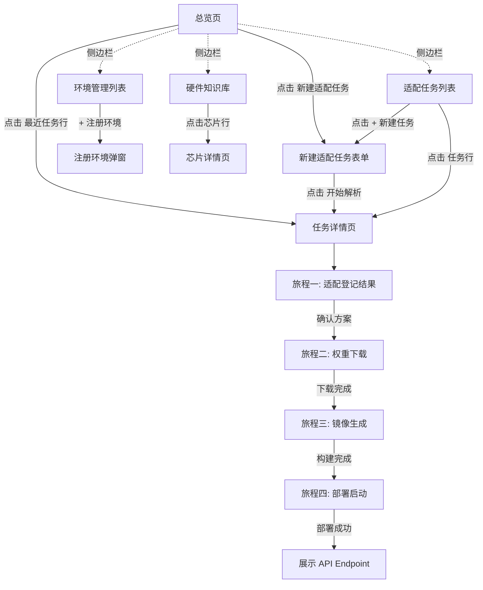

# LLM Deploy — 交互原型设计文档

| 文档属性 | 内容 |
|:--|:--|
| 产品名称 | LLM Deploy（大模型自助部署平台） |
| 版本 | v1.0 |
| 日期 | 2026-03-01 |
| 参考交互 | 深信服AI算力网关 (Sangfor AI Computility Platform) |

---

## 1. 设计风格规范（源自参考系统）

### 1.1 从参考系统提取的设计语言

| 维度 | 规范 |
|:--|:--|
| **整体布局** | 左侧边栏导航（~200px）+ 右侧主内容区，经典 B 端管理台布局 |
| **主色调** | 蓝色系 (#1677FF)，用于主按钮、活跃菜单、链接、标签 |
| **背景色** | 页面底层浅灰 (#F5F7FA)，内容卡片白色 (#FFFFFF)，卡片带轻阴影 |
| **侧边栏** | 白底，选中项蓝色填充+白色文字，未选中项深灰文字，每项带图标 |
| **页面标题** | 左侧蓝色竖线标记 + 加粗标题，如 `| 总览` |
| **功能引导** | 页面顶部放置功能介绍卡片（双列/三列），含简述 + "立即创建" 链接 |
| **数据表格** | 浅色表头、悬停高亮、右侧行内操作按钮（编辑/删除/禁用） |
| **操作栏** | 表格上方放 `+ 创建` 主按钮（蓝色实心）+ 筛选下拉 + 搜索框 + 刷新 |
| **弹窗/对话框** | 白色圆角卡片，标题栏 + 表单 + 底部"确定"（蓝色实心）/"取消"（描边） |
| **标签** | 小圆角药片形标签，如 `语义路由`、`文本生成` |
| **面包屑** | 二级页面顶部显示路径，如 `模型路由 > 路由详情（模型名称）` |
| **Tab 切换** | 下划线风格，如 `模型列表` / `API 调用` |
| **统计卡片** | 图标 + 大数字 + 副标题，横向排列 |
| **图表** | 柱状图 + 折线图，蓝/绿/灰配色，支持 Tooltip 悬停详情 |
| **分页** | 底部右对齐，`共 X 项 < 1 > 每页 50 条 前往 _ 页` |
| **空状态** | 居中展示引导卡片（图标+描述+操作入口） |

### 1.2 LLM Deploy 适配调整

| 调整项 | 说明 |
|:--|:--|
| 产品标识 | Logo + "LLM Deploy" + 副标题 "大模型自助部署平台" |
| 侧边栏菜单 | 按 LLM Deploy 功能重新定义（见下文） |
| 色彩语义 | 绿色=成功/已完成，黄色=进行中/警告，红色=失败/错误，蓝色=主操作 |
| 步骤条 | 新增四旅程步骤条组件（参考系统无此组件），用于任务详情页顶部 |
| 终端日志 | 新增终端日志输出组件（黑底白字等宽字体），用于构建/部署日志 |

---

## 2. 全局导航结构

### 2.1 侧边栏菜单

```
┌──────────────────────┐
│ 🔷 LLM Deploy        │
│    大模型自助部署平台   │
│                      │
│ 🏠 总览               │  ← 默认首页
│ 📋 适配任务            │  ← 四旅程主入口
│ 🖥️ 环境管理            │  ← 目标部署环境
│ 📦 硬件知识库          │  ← 硬件/引擎兼容矩阵
│                      │
│                      │
│                      │
│                      │
│ 👤 Administrator     │
│ ⚙                    │
└──────────────────────┘
```

### 2.2 页面地图

```
总览
├── 快速开始引导卡片
└── 统计数据

适配任务
├── 任务列表页
├── 新建适配任务（旅程一表单）
└── 任务详情页（四旅程步骤视图）
    ├── 旅程一：适配登记结果
    ├── 旅程二：模型权重下载
    ├── 旅程三：推理引擎镜像生成
    └── 旅程四：部署与启动

环境管理
├── 环境列表页
└── 注册新环境

硬件知识库
├── 硬件列表页
└── 硬件详情（兼容引擎 + 容器规则）
```

---

## 3. 页面详细设计

### 3.1 总览页

**布局**：参照参考系统首页结构

```
┌─侧边栏─┬──────────────── 主内容区 ──────────────────────────────┐
│        │ | 总览                                                  │
│ 🏠 总览 │                                                        │
│ 📋 适配 │ ┌─ 功能介绍卡片 ─────────────────────────────────────┐  │
│ 🖥️ 环境 │ │                                                    │  │
│ 📦 硬件 │ │  🔷 模型适配加速器                                    │  │
│        │ │  ✅ 输入模型+硬件，自动完成适配全流程                     │  │
│        │ │  ✅ 支持 N卡 + 5大国产卡（昇腾/海光/沐曦/昆仑芯/天数）     │  │
│        │ │  ✅ 自动推算启动参数，首次启动即为最优配置                  │  │
│        │ │                                                    │  │
│        │ └────────────────────────────────────────────────────┘  │
│        │                                                        │
│        │  快速开始                                                │
│        │ ┌──────────────┐ ┌──────────────┐ ┌──────────────┐     │
│        │ │  新建适配任务   │ │  注册部署环境   │ │  查看硬件知识库 │     │
│        │ │  输入模型名称或 │ │  添加Docker主机 │ │  查看已支持的   │     │
│        │ │  链接+硬件型号  │ │  或K8s集群     │ │  硬件和推理引擎 │     │
│        │ │  开始创建 →    │ │  开始创建 →    │ │  开始查看 →    │     │
│        │ │      01       │ │      02       │ │      03       │     │
│        │ └──────────────┘ └──────────────┘ └──────────────┘     │
│        │                                                        │
│        │ ┌─ 统计概览 ──────────────────────────────────────────┐ │
│        │ │  🔷 -          🔷 -           🔷 -          🔷 -    │ │
│        │ │  适配任务总数   已完成任务     运行中服务     注册环境数 │ │
│        │ └────────────────────────────────────────────────────┘ │
│        │                                                        │
│        │ ┌─ 最近任务 ──────────────────────────────────────────┐ │
│        │ │  任务名称         模型          硬件       状态       │ │
│        │ │  Qwen2.5-72B_... Qwen2.5-72B  910B4    🟢 已部署   │ │
│        │ │  Llama3-70B_...  Llama3-70B   H100     🔵 构建中   │ │
│        │ │  ...                                                │ │
│        │ └────────────────────────────────────────────────────┘ │
└────────┴────────────────────────────────────────────────────────┘
```

### 3.2 适配任务列表页

**布局**：参照参考系统"模型路由"列表页

```
┌─侧边栏─┬──────────────── 主内容区 ──────────────────────────────────┐
│        │ | 适配任务                                                   │
│        │                                                             │
│ 📋 适配 │  ┌─ 功能指引 ──────────────────────────────────────────┐    │
│  (选中)  │  │  输入一个模型名称/链接 + 一个硬件型号，系统自动完成从     │    │
│        │  │  模型解析、权重下载、镜像生成到部署验证的全流程            │    │
│        │  └──────────────────────────────────────────────────────┘    │
│        │                                                             │
│        │  [+ 新建任务]   全部状态 ▼   全部硬件 ▼   🔍 任务名称   🔄   │
│        │                                                             │
│        │  ┌──────────────────────────────────────────────────────┐    │
│        │  │ 任务名称 ↕     模型          硬件      推理引擎  状态     │    │
│        │  │                                                      │    │
│        │  │ Qwen2.5-72B    Qwen/Qwen2.5  昇腾     MindIE   🟢 已部署│    │
│        │  │ _910B4_0301    -72B-Instruct  910B4    1.0      操作 ▸ │    │
│        │  │                                                      │    │
│        │  │ Llama3-70B     meta-llama/    H100     vLLM     🔵 构建中│    │
│        │  │ _H100_0228     Llama-3-70B    80G      0.6      操作 ▸ │    │
│        │  │                                                      │    │
│        │  │ DeepSeek-V3    deepseek-ai/   海光     vLLM     🟡 解析中│    │
│        │  │ _K100_0301     DeepSeek-V3    K100_AI  -DCU     操作 ▸ │    │
│        │  └──────────────────────────────────────────────────────┘    │
│        │                                                             │
│        │                          共 3 项  < 1 >  每页 50 条          │
└────────┴─────────────────────────────────────────────────────────────┘
```

**状态标签色彩**：

| 状态 | 颜色 | 标签 |
|:--|:--|:--|
| 解析中 | 黄色 | 🟡 解析中 |
| 已解析 | 蓝色 | 🔵 已解析 |
| 下载中 | 蓝色 | 🔵 下载中 (45%) |
| 下载失败 | 红色 | 🔴 下载中断 |
| 构建中 | 蓝色 | 🔵 构建中 |
| 已构建 | 蓝色 | 🔵 已构建 |
| 部署中 | 蓝色 | 🔵 部署中 |
| 已部署 | 绿色 | 🟢 已部署 |
| 失败 | 红色 | 🔴 失败 |

**操作菜单**（行内下拉）：查看详情 / 继续执行 / 删除

### 3.3 新建适配任务（旅程一入口）

**触发方式**：点击列表页 `[+ 新建任务]` 按钮

**布局**：参照参考系统"创建智能路由"全页表单（非弹窗），面包屑导航 `适配任务 > 新建适配任务`

```
┌─侧边栏─┬──────────────── 主内容区 ──────────────────────────────────┐
│        │ ← 适配任务 > 新建适配任务                                    │
│        │                                                             │
│        │  模型信息                                                     │
│        │  ┌──────────────────────────────────────────────────────┐    │
│        │  │                                                      │    │
│        │  │  模型标识：  [                                    ]   │    │
│        │  │             支持模型名称(Qwen/Qwen2.5-72B-Instruct)  │    │
│        │  │             或 HuggingFace / ModelScope 链接          │    │
│        │  │                                                      │    │
│        │  │  硬件型号：  [ 请选择或输入 ▼                      ]   │    │
│        │  │             ┌─────────────────────────────┐          │    │
│        │  │             │  🔹 NVIDIA                   │          │    │
│        │  │             │    H100 80G                  │          │    │
│        │  │             │    A100 80G                  │          │    │
│        │  │             │    A100 40G                  │          │    │
│        │  │             │  🔹 华为昇腾                  │          │    │
│        │  │             │    昇腾910B3 64G              │          │    │
│        │  │             │    昇腾910B4 64G              │          │    │
│        │  │             │    昇腾910C 128G              │          │    │
│        │  │             │  🔹 海光 DCU                  │          │    │
│        │  │             │    K100_AI 64G               │          │    │
│        │  │             │  🔹 沐曦 MetaX                │          │    │
│        │  │             │    ...                       │          │    │
│        │  │             │  ─── 手动输入 ───             │          │    │
│        │  │             └─────────────────────────────┘          │    │
│        │  │                                                      │    │
│        │  │  任务名称：  [  自动生成: Qwen2.5-72B_910B4_0301  ]   │    │
│        │  │             (选填，可自定义)                           │    │
│        │  │                                                      │    │
│        │  └──────────────────────────────────────────────────────┘    │
│        │                                                             │
│        │  [开始解析]  [取消]                                          │
│        │                                                             │
└────────┴─────────────────────────────────────────────────────────────┘
```

**交互说明**：
- 硬件型号下拉按厂商分组，支持搜索过滤
- 支持手动输入未收录型号（触发手动录入流程）
- 点击"开始解析"后跳转到任务详情页，自动进入解析状态

### 3.4 适配任务详情页（核心页面）

**布局**：面包屑 `适配任务 > Qwen2.5-72B_910B4_0301`

这是四旅程的统一承载页面，顶部用 **步骤条** 展示旅程进度，下方展示当前旅程的详细内容。

```
┌─侧边栏─┬──────────────── 主内容区 ──────────────────────────────────────┐
│        │ ← 适配任务 > Qwen2.5-72B_910B4_0301                           │
│        │                                                                │
│        │ ┌─ 四旅程步骤条 ─────────────────────────────────────────────┐  │
│        │ │                                                            │  │
│        │ │  ● 适配登记 ──── ● 权重下载 ──── ○ 镜像生成 ──── ○ 部署启动 │  │
│        │ │    ✅ 已完成       🔵 进行中       ⬚ 待执行       ⬚ 待执行  │  │
│        │ │                                                            │  │
│        │ └────────────────────────────────────────────────────────────┘  │
│        │                                                                │
│        │  (以下为当前活跃旅程的详细内容，见各旅程子节描述)                   │
│        │                                                                │
└────────┴────────────────────────────────────────────────────────────────┘
```

**步骤条交互**：
- 已完成步骤可点击回看结果
- 当前步骤高亮展示
- 未来步骤灰色不可点击

---

#### 3.4.1 旅程一结果区：适配登记

**状态**：解析完成后展示，步骤条第一步变为 ✅

```
│  ┌─ 模型信息 ──────────────────────┐  ┌─ 硬件信息 ──────────────────┐  │
│  │  模型名称    Qwen2.5-72B-Instruct│  │  芯片型号    昇腾 910B4      │  │
│  │  参数量      72B                 │  │  单卡显存    64 GB HBM2e    │  │
│  │  架构        Qwen2ForCausalLM   │  │  算力       320 TFLOPS FP16│  │
│  │  原生精度    BF16                │  │  互联       HCCS 56GB/s    │  │
│  │  最大上下文  131,072             │  │  BF16支持   ✅              │  │
│  │  权重大小    144.3 GB            │  │                            │  │
│  │  协议        Apache-2.0         │  │                            │  │
│  └─────────────────────────────────┘  └────────────────────────────┘  │
│                                                                       │
│  ┌─ 推荐适配方案 ──────────────────────────────────────────────────┐   │
│  │                                                                │   │
│  │  适配状态    ✅ 官方已验证 (昇腾 MindIE 1.0 ModelZoo 已收录)     │   │
│  │                                                                │   │
│  │  推理引擎：  ● MindIE 1.0 (推荐)                               │   │
│  │             ○ vLLM-Ascend 0.6.0                               │   │
│  │                                                                │   │
│  │  计算精度：  ● BF16 (模型原生)                                  │   │
│  │             ○ FP16                                            │   │
│  │             ○ INT8                                            │   │
│  │                                                                │   │
│  │  异常检测    ⚠️ 需要 --trust-remote-code（自定义模型代码）        │   │
│  │             ℹ️ 已自动添加到启动参数                              │   │
│  │                                                                │   │
│  └────────────────────────────────────────────────────────────────┘   │
│                                                                       │
│  [确认方案，进入下一步 →]                                              │
```

**交互说明**：
- 推理引擎和计算精度支持用户修改（Radio 选择）
- 异常检测信息以 ⚠️/ℹ️ 标签形式展示
- 点击"确认方案"后步骤条第一步变绿 ✅，第二步激活

---

#### 3.4.2 旅程二区域：模型权重下载

```
│  ┌─ 下载配置 ──────────────────────────────────────────────────────┐  │
│  │                                                                │  │
│  │  下载源：    ● ModelScope (推荐，国内网络更稳定)                  │  │
│  │             ○ HuggingFace                                     │  │
│  │                                                                │  │
│  │  下载目标：  ● 下载到本地                                       │  │
│  │             ○ 下载到指定环境                                    │  │
│  │                                                                │  │
│  │  存储路径：  [ /data/models/modelscope/Qwen2.5-72B-Instruct ]  │  │
│  │  磁盘校验：  ✅ 剩余 800 GB (需要 173.2 GB，含 20% 余量)        │  │
│  │                                                                │  │
│  └────────────────────────────────────────────────────────────────┘  │
│                                                                      │
│  [开始下载]                                                          │
│                                                                      │
│  ┌─ 下载进度 ──────────────────────────────────────────────────────┐  │
│  │                                                                │  │
│  │  总进度  ████████████░░░░░░░░  62%   89.5 / 144.3 GB           │  │
│  │  速度    156 MB/s          预计剩余  6 分 12 秒                  │  │
│  │                                                                │  │
│  │  文件名                      大小       状态                     │  │
│  │  model-00001-of-00030.sft   4.8 GB    ✅ 已完成                 │  │
│  │  model-00002-of-00030.sft   4.8 GB    ✅ 已完成                 │  │
│  │  ...                                                           │  │
│  │  model-00019-of-00030.sft   4.8 GB    🔵 下载中 (78%)           │  │
│  │  model-00020-of-00030.sft   4.8 GB    ⬚ 等待中                 │  │
│  │  ...                                                           │  │
│  │  config.json                 2 KB     ✅ 已完成                 │  │
│  │  tokenizer_config.json       8 KB     ✅ 已完成                 │  │
│  │                                                                │  │
│  └────────────────────────────────────────────────────────────────┘  │
│                                                                      │
│  下载完成后自动校验 SHA256                                             │
│  [暂停]  [取消下载]                                                   │
```

**交互说明**：
- 选择"下载到指定环境"时，展示环境下拉选择 + 远程路径输入
- 下载进度条实时更新（前端 2s 轮询）
- 下载失败时展示重试按钮，支持断点续传
- SHA256 校验完成后自动跳转到旅程三

---

#### 3.4.3 旅程三区域：推理引擎镜像生成

分为两阶段：**参数推算** → **镜像构建**

**阶段一：参数推算结果展示**

```
│  ┌─ 查询结果摘要 ──────────────────────────────────────────────────┐  │
│  │  📄 模型官方说明    推荐 vLLM >= 0.6.0, 需 --trust-remote-code   │  │
│  │  🔧 厂商适配状态    昇腾 MindIE 1.0 已验证该模型 ✅               │  │
│  │  🐳 推荐基础镜像    ascendhub.huawei.com/mindie:1.0-cann8.0     │  │
│  └────────────────────────────────────────────────────────────────┘  │
│                                                                      │
│  ┌─ 推荐硬件部署规格 ─────────────────────────────────────────────┐   │
│  │                                                                │   │
│  │  硬件：   昇腾 910B4 64G                                       │   │
│  │  推荐卡数：  [ 4 ]  张                          [修改]          │   │
│  │  总显存：   256 GB                                              │   │
│  │  部署模式： 单机 Tensor Parallel                                │   │
│  │                                                                │   │
│  └────────────────────────────────────────────────────────────────┘   │
│                                                                      │
│  ┌─ 启动参数详情 ──────────────────────────────────────────────────┐  │
│  │                                                                │  │
│  │  参数                   推荐值     推算依据               可调整 │  │
│  │  ─────────────────────────────────────────────────────────────  │  │
│  │  dtype                  bf16      config.json + 910B4 支持     是 │  │
│  │  tensor-parallel-size   4         144GB / 64GB → 最少3, 对齐4  联动│  │
│  │  max-model-len          32768     剩余显存支持 32K 上下文       是 │  │
│  │  max-num-seqs           32        基于 KV Cache 容量推算       是 │  │
│  │  enforce-eager          true      910B4 不支持 CUDA Graph     自动│  │
│  │  trust-remote-code      true      Model Card 明确要求         自动│  │
│  │                                                                │  │
│  └────────────────────────────────────────────────────────────────┘  │
│                                                                      │
│  ┌─ 显存分配可视化 ────────────────────────────────────────────────┐  │
│  │  每卡 64 GB 显存分配：                                          │  │
│  │  ████████████████████░░░░░░░░░░░░░░░░░░░░░░░░░░░░░░            │  │
│  │  ██████████████ 权重 36GB (56%)                                │  │
│  │  ████████ KV Cache 21.6GB (34%)                                │  │
│  │  ██ 运行时 3.2GB (5%)                                          │  │
│  │  ░░ 预留 3.2GB (5%)                                            │  │
│  └────────────────────────────────────────────────────────────────┘  │
│                                                                      │
│  [确认参数，开始构建 →]                                               │
```

**参数修改交互**：
- 点击"修改"卡数按钮 → 展示数字输入框（如改为 8）
- 修改后系统实时重算所有参数 → 变化项红色高亮标注
- 可调整的参数支持直接编辑

**阶段二：镜像构建进度**

```
│  ┌─ 构建进度 ──────────────────────────────────────────────────────┐  │
│  │                                                                │  │
│  │  镜像 Tag:  llm-deploy/qwen2.5-72b:mindie-ascend910b4-0301    │  │
│  │  状态:      🔵 构建中...                                        │  │
│  │                                                                │  │
│  │  ┌─ 构建日志 (终端风格) ─────────────────────────────────────┐  │  │
│  │  │ $ docker build -t llm-deploy/qwen2.5-72b:mindie...       │  │  │
│  │  │ Step 1/8 : FROM ascendhub.huawei.com/mindie:1.0-cann8.0 │  │  │
│  │  │  ---> 3a2b4c5d6e7f                                      │  │  │
│  │  │ Step 2/8 : RUN pip install transformers>=4.40.0          │  │  │
│  │  │  ---> Running in 8f9a0b1c2d3e                           │  │  │
│  │  │ ...                                                      │  │  │
│  │  │ █                                                        │  │  │
│  │  └──────────────────────────────────────────────────────────┘  │  │
│  │                                                                │  │
│  └────────────────────────────────────────────────────────────────┘  │
```

**构建完成后展示**：

```
│  ┌─ 构建完成 ✅ ───────────────────────────────────────────────────┐  │
│  │                                                                │  │
│  │  📦 镜像信息                                                    │  │
│  │  名称:      llm-deploy/qwen2.5-72b:mindie-ascend910b4-0301   │  │
│  │  大小:      15.2 GB                                            │  │
│  │  基础镜像:  ascendhub.huawei.com/mindie:1.0-cann8.0           │  │
│  │  推理引擎:  MindIE 1.0                                        │  │
│  │  API封装:   无需 (MindIE 原生支持 OpenAI API)                   │  │
│  │                                                                │  │
│  │  🚀 启动命令                             [复制]                 │  │
│  │  ┌──────────────────────────────────────────────────────────┐  │  │
│  │  │ mindie-service \                                        │  │  │
│  │  │   --model /models/Qwen2.5-72B-Instruct \               │  │  │
│  │  │   --npu 0,1,2,3 \                                      │  │  │
│  │  │   --dtype bf16 \                                        │  │  │
│  │  │   --max-seq-len 32768 \                                 │  │  │
│  │  │   --max-batch-size 32 \                                 │  │  │
│  │  │   --trust-remote-code \                                 │  │  │
│  │  │   --host 0.0.0.0 --port 8000                            │  │  │
│  │  └──────────────────────────────────────────────────────────┘  │  │
│  │                                                                │  │
│  │  💻 推荐部署规格                                                │  │
│  │  硬件:     昇腾 910B4 64G x 4                                  │  │
│  │  部署模式: 单机 Tensor Parallel                                 │  │
│  │                                                                │  │
│  └────────────────────────────────────────────────────────────────┘  │
│                                                                      │
│  [进入部署 →]                                                        │
```

---

#### 3.4.4 旅程四区域：部署与启动

分为三阶段：**部署配置** → **环境预检** → **部署执行+验证**

**阶段一：部署配置**

```
│  ┌─ 部署配置 ──────────────────────────────────────────────────────┐  │
│  │                                                                │  │
│  │  目标环境：  [ prod-ascend-01 (Docker, 8x910B4) ▼ ]            │  │
│  │                                                                │  │
│  │  部署模式：                                                     │  │
│  │  ┌─────────────────┐ ┌─────────────────┐ ┌────────────────┐   │  │
│  │  │ ● Docker 单实例  │ │ ○ Docker 多实例  │ │ ○ K8s 部署     │   │  │
│  │  │   1个容器, N张卡  │ │   多容器+负载均衡 │ │  K8s YAML部署  │   │  │
│  │  └─────────────────┘ └─────────────────┘ └────────────────┘   │  │
│  │                                                                │  │
│  │  文件状态：                                                     │  │
│  │  模型权重    ✅ 已就位 (/data/models/Qwen2.5-72B-Instruct)     │  │
│  │  推理镜像    ⚠️ 需上传 (本地 → 目标环境)                        │  │
│  │              上传方式: ● docker save + 传输   ○ push到镜像仓库   │  │
│  │                                                                │  │
│  └────────────────────────────────────────────────────────────────┘  │
│                                                                      │
│  [开始预检]                                                          │
```

**阶段二：环境预检报告**

```
│  ┌─ 环境预检报告 — prod-ascend-01 ──────────────────────────────┐    │
│  │                                                              │    │
│  │  ✅ NPU 设备检测      8 x Ascend 910B4 64G   (需要 4, 通过)  │    │
│  │  ✅ NPU 驱动版本      24.1.RC3               (≥ 24.1.RC2)   │    │
│  │  ✅ CANN 版本         8.0.RC3                (匹配 MindIE)  │    │
│  │  ✅ Docker 版本       24.0.7                 (≥ 20.10)      │    │
│  │  ✅ Ascend Runtime    已安装                                  │    │
│  │  ✅ 磁盘空间          剩余 500GB              (需要 200GB)   │    │
│  │  ✅ 模型权重          已就位                                  │    │
│  │  ✅ 推理镜像          已上传                                  │    │
│  │                                                              │    │
│  │  结果: 全部通过 ✅                                            │    │
│  │                                                              │    │
│  └──────────────────────────────────────────────────────────────┘    │
│                                                                      │
│  [立即部署]                                                          │
```

**预检不通过时**：

```
│  │  ❌ NPU 驱动版本      24.0.RC1               (需要 ≥ 24.1.RC2) │
│  │     💡 修复建议：请将驱动从 24.0.RC1 升级到 24.1.RC2+              │
│  │                                                                │
│  │  结果: 1 项不通过 ❌                                             │
│  │                                                                │
│  │  [重新预检]  [强制跳过(需确认风险)]                                │
```

**阶段三：部署执行 + 验证结果**

```
│  ┌─ 部署状态 ──────────────────────────────────────────────────────┐  │
│  │                                                                │  │
│  │  容器状态:  🟢 Running                                          │  │
│  │                                                                │  │
│  │  ┌─ 容器日志 (终端风格，实时流) ─────────────────────────────┐  │  │
│  │  │ Loading model Qwen2.5-72B-Instruct...                   │  │  │
│  │  │ Model loaded on NPU 0,1,2,3 (4 devices)                │  │  │
│  │  │ Starting MindIE serving on 0.0.0.0:8000...              │  │  │
│  │  │ Health check: OK                                        │  │  │
│  │  │ Ready to serve requests.                                │  │  │
│  │  └──────────────────────────────────────────────────────────┘  │  │
│  │                                                                │  │
│  └────────────────────────────────────────────────────────────────┘  │
│                                                                      │
│  ┌─ ✅ 模型服务部署成功！ ──────────────────────────────────────────┐ │
│  │                                                                │ │
│  │  🌐 API 地址      http://10.0.1.100:8000/v1/chat/completions  │ │
│  │  📊 服务状态      Running                                      │ │
│  │  💻 硬件          昇腾 910B4 64G x 4                           │ │
│  │  🚀 推理引擎      MindIE 1.0                                   │ │
│  │  ⏱️ 首次响应延迟   2.3s                                         │ │
│  │                                                                │ │
│  │  测试命令                                        [复制]         │ │
│  │  ┌──────────────────────────────────────────────────────────┐ │ │
│  │  │ curl http://10.0.1.100:8000/v1/chat/completions \       │ │ │
│  │  │   -H "Content-Type: application/json" \                 │ │ │
│  │  │   -d '{"model":"Qwen2.5-72B-Instruct",                 │ │ │
│  │  │        "messages":[{"role":"user","content":"hello"}]}'  │ │ │
│  │  └──────────────────────────────────────────────────────────┘ │ │
│  │                                                                │ │
│  └────────────────────────────────────────────────────────────────┘ │
```

---

### 3.5 环境管理页

**布局**：参照参考系统 "API Key" 列表页

```
│  | 环境管理                                                          │
│                                                                      │
│  ⓘ 注册目标部署环境，用于模型服务部署。支持 Docker 主机和 K8s 集群。      │
│                                                                      │
│  [+ 注册环境]   全部类型 ▼   🔍 环境名称   🔄                         │
│                                                                      │
│  环境名称         类型            连接方式    硬件信息          操作     │
│  ──────────────────────────────────────────────────────────────────   │
│  prod-ascend-01   Docker 主机    SSH        8x 昇腾910B4     编辑 删除│
│  dev-nvidia-01    Docker 主机    SSH        4x H100 80G     编辑 删除│
│  k8s-cluster-01   K8s 集群      kubeconfig  混合集群         编辑 删除│
│                                                                      │
│                                    共 3 项  < 1 >  每页 50 条         │
```

**注册新环境弹窗**（参照"创建"弹窗风格）：

```
┌─ 注册新环境 ──────────────────────── ✕ ─┐
│                                         │
│  环境名称：  [                       ]   │
│                                         │
│  环境类型：  ● Docker 主机   ○ K8s 集群  │
│                                         │
│  ── Docker 主机配置 ──                   │
│  SSH 地址：  [  10.0.1.100:22       ]    │
│  SSH 用户：  [  root                ]    │
│  认证方式：  ● 密码   ○ 密钥              │
│  密码：      [  ********           ]    │
│                                         │
│             [测试连接]                   │
│              ✅ 连接成功                 │
│                                         │
│             [确定]       [取消]          │
└─────────────────────────────────────────┘
```

### 3.6 硬件知识库页

**布局**：参照参考系统"模型接入"空状态 + 列表风格

```
│  | 硬件知识库                                                         │
│                                                                      │
│  ┌─────────────┐ ┌─────────────┐ ┌─────────────┐                    │
│  │ 🟢 NVIDIA    │ │ 🔵 华为昇腾  │ │ 🔵 海光 DCU  │                    │
│  │   3 款芯片   │ │   3 款芯片   │ │   1 款芯片   │                    │
│  └─────────────┘ └─────────────┘ └─────────────┘                    │
│  ┌─────────────┐ ┌─────────────┐ ┌─────────────┐                    │
│  │ 🔵 沐曦MetaX │ │ 🔵 昆仑芯    │ │ 🔵 天数智芯  │                    │
│  │   3 款芯片   │ │   2 款芯片   │ │   2 款芯片   │                    │
│  └─────────────┘ └─────────────┘ └─────────────┘                    │
│                                                                      │
│  ── 华为昇腾 芯片列表 ──                                               │
│                                                                      │
│  芯片型号    显存      算力(FP16)    互联     推荐引擎     兼容引擎数    │
│  ──────────────────────────────────────────────────────────────────   │
│  910B3      64GB      280 TFLOPS   HCCS    MindIE 1.0    2         │
│  910B4      64GB      320 TFLOPS   HCCS    MindIE 1.0    2         │
│  910C       128GB     400 TFLOPS   HCCS    MindIE 2.0    1         │
```

点击某一行芯片进入详情页（面包屑 `硬件知识库 > 昇腾 910B4`），展示：
- 芯片规格卡片
- 兼容引擎列表（引擎名、版本、最低驱动、最低 SDK、基础镜像）
- 容器化规则（设备路径、环境变量、K8s 资源声明）

---

## 4. 关键交互组件规范

### 4.1 组件清单

| 组件 | 使用场景 | 来源 |
|:--|:--|:--|
| 左侧边栏导航 | 全局 | 参考系统一致 |
| 功能引导卡片 | 列表页顶部 | 参考系统一致 |
| 数据表格 + 分页 | 任务列表、环境列表、文件列表 | 参考系统一致 |
| 操作栏（按钮+筛选+搜索） | 列表页 | 参考系统一致 |
| 弹窗对话框 | 注册环境、添加模型 | 参考系统一致 |
| 面包屑 | 二级/三级页面 | 参考系统一致 |
| Tab 页签 | 任务详情内容切换 | 参考系统一致 |
| 统计卡片 | 总览页 | 参考系统一致 |
| **四旅程步骤条** | 任务详情页顶部 | **新增组件** |
| **终端日志输出** | 构建日志、部署日志 | **新增组件**（黑底白字等宽字体，自动滚动） |
| **进度条 + 文件列表** | 下载进度 | **新增组件** |
| **参数推算表格** | 旅程三参数展示 | **新增组件**（含推算依据列、可编辑列） |
| **显存分配条形图** | 旅程三显存可视化 | **新增组件**（水平堆叠条形图） |
| **预检报告** | 旅程四环境预检 | **新增组件**（逐项 ✅/❌ 列表） |
| **卡片选择器** | 部署模式、硬件厂商 | 参照参考系统"路由策略"选择 |

### 4.2 状态颜色规范

| 颜色 | 色值 | 语义 |
|:--|:--|:--|
| 蓝色 | #1677FF | 主操作、进行中状态、链接 |
| 绿色 | #52C41A | 成功、已完成、通过 |
| 黄色/橙色 | #FAAD14 | 警告、需注意 |
| 红色 | #FF4D4F | 错误、失败、不通过 |
| 灰色 | #8C8C8C | 未开始、禁用 |

---

## 5. 页面流转图



---

*文档结束*
